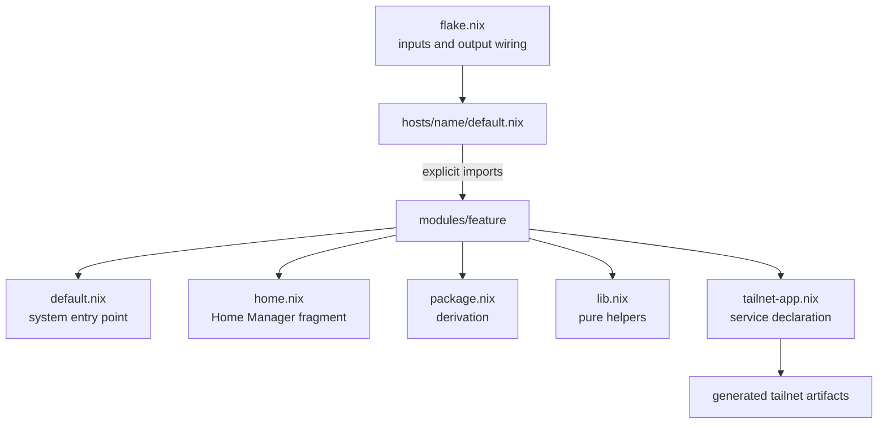

# dots

multi-host Nix configuration for nix-darwin, NixOS, and Home Manager. hosts
select capabilities explicitly; each capability keeps its
system, user, package, scripts, tests, and assets together.

## architecture



- `flake.nix` owns inputs, platform constructors, overlays, checks, packages,
  and named configuration outputs.
- `hosts/<name>/` owns machine identity, hardware and topology, feature
  selection, and host-specific values.
- `modules/<feature>/` owns a reusable capability across system and Home
  Manager scopes. supporting scripts, tests, packages, and assets stay with
  that feature.
- hosts import features directly. repeated imports are intentional: there are
  no implicit `base`, `desktop`, or `dev` bundles.
- `assets/`, `config/`, `overlays/`, and `scripts/` contain repository-wide
  support files rather than Nix architecture roots.

### feature file contracts

| file | contract |
| --- | --- |
| `default.nix` | system-level feature entry point; importing `modules/foo` selects it |
| `home.nix` | direct Home Manager module, imported by the feature's system adapter |
| `package.nix` | reusable package expression, imported directly rather than placed in a module `imports` list |
| `lib.nix` | pure data or helpers without a NixOS option graph |
| `service.nix` | explicit deployment integration when packaging and service policy are separate |
| `tailnet-app.nix` | declarative tailnet and Cloudflare metadata discovered by the catalog |

## configurations

| output | platform | role |
| --- | --- | --- |
| `mbp-m2` | aarch64-darwin | primary graphical workstation |
| `mmn-m4` | aarch64-darwin | household storage and media service host |
| `lgo-z2e` | x86_64-linux | Niri/Jovian graphical system |
| `htz-relay` | x86_64-linux | storage, Syncthing, and application relay |
| `gru-relay` | x86_64-linux | Tailscale exit node and ingress relay |

## common operations

```bash
# inspect inputs and format
nix flake metadata
nix fmt

# verify the Darwin host before activation
nix build .#darwinConfigurations.mbp-m2.system --dry-run
nix build .#darwinConfigurations.mbp-m2.system
sudo darwin-rebuild switch --flake .#mbp-m2

# verify a NixOS host before activation
nix build .#nixosConfigurations.lgo-z2e.config.system.build.toplevel --dry-run
nix build .#nixosConfigurations.lgo-z2e.config.system.build.toplevel
sudo nixos-rebuild switch --flake .#lgo-z2e
```

replace the host name with the target configuration. do not cross-build by
default.

## tailnet declarations

features publish services with `modules/**/tailnet-app.nix`. the catalog
validates those declarations and projects them into:

- `generated/fleet-apps.json`
- `cloudflare/apps.auto.tfvars.json`
- `tailscale/services.json`
- `tailscale/capabilities.json`

regenerate and verify the projections after changing a declaration:

```bash
nix run .#generate-tailnet-artifacts
nix build .#checks.aarch64-darwin.tailnet-artifacts
```

generated JSON is output, not an additional source of truth.

## secrets

secrets use sops-nix. `.sops.yaml` contains public recipients, while encrypted
values live in `secrets.yaml` and feature-local files such as
`modules/o11y/secrets.yaml`. runtime declarations live in
`modules/secrets/default.nix`.

```bash
sops secrets.yaml
sops updatekeys secrets.yaml
```

never commit private age keys. see [SECRETS.md](./SECRETS.md) for setup and
rotation.
