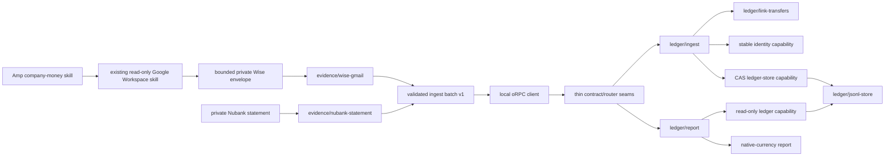

# company money

## decision

build the reusable capability under `modules/company-money/`. keep Amp orchestration in `modules/agents/skills/company-money/SKILL.md` as instructions only. mailbox access and credentials remain in the existing read-only Amp Google Workspace skill; this package receives only bounded private transient envelopes.

organize implementation by behavioral verticals. each vertical owns its exact ArkType schemas, inferred types, behavior, capability interfaces, and colocated tests. retain the mechanics already proven by `modules/fleet-mesh/`—versioned observational schemas, handler-free oRPC, plain use cases, `implement(contract)`, a local client, and browser/Node package boundaries—but do not copy its package-wide schema/contract/operations file split.

the remaining horizontal files are thin composition seams rather than domain layers:

- `company-money-contract.ts` assembles operation declarations exported by the ledger verticals;
- `company-money-router.ts` binds those declarations to their use cases and creates the local client;
- `company-money-public.ts` defines the browser-safe export and public schema-catalog boundary;
- `company-money-node.ts` composes private configuration, evidence translators, persistence, identity, router, and CLI dependencies.

`modules/agents/skills/` remains the wrong implementation home. `modules/agents/default.nix` recursively projects nearly every non-Nix file in that tree into the installed skill collection. dependencies, lockfiles, implementation source, private runtime behavior, and generated executables belong to the feature package.

proposed implementation tree:

```text
modules/company-money/
├── PLAN.md
├── README.md
├── default.nix
├── package.nix
├── package.json
├── pnpm-lock.yaml
├── pnpm-workspace.yaml
├── tsconfig.json
├── tsconfig.build.json
├── money.ts
├── money.test.ts
├── ledger/
│   ├── state.ts
│   ├── state.test.ts
│   ├── ingest.ts
│   ├── ingest.test.ts
│   ├── report.ts
│   ├── report.test.ts
│   ├── link-transfers.ts
│   ├── link-transfers.test.ts
│   ├── jsonl-store.ts
│   ├── jsonl-store.test.ts
│   ├── sha256-identity.ts
│   └── sha256-identity.test.ts
├── evidence/
│   ├── nubank-statement.ts
│   ├── nubank-statement.test.ts
│   ├── wise-gmail.ts
│   └── wise-gmail.test.ts
├── private-config.ts
├── private-config.test.ts
├── company-money-contract.ts
├── company-money-router.ts
├── company-money-router.test.ts
├── company-money-public.ts
├── company-money-node.ts
├── company-money-cli.ts
├── company-money-cli.test.ts
├── company-money-bin.ts
└── package-boundary.test.ts

modules/agents/skills/company-money/
└── SKILL.md
```

the Nix module should install a manually invoked CLI on `mbp-m2`. v1 does not need a daemon, schedule, server, tailnet declaration, or activation-created data directory.

the private runtime root is `/Users/bdsqqq/commonplace/01_files/money/company-ledger`. the existing broad `commonplace` Syncthing setup handles this path. company-money does not add a dedicated Syncthing folder, receiver topology, files-browser exclusion, or multi-host privacy gate.

v1 remains single-writer at the application layer: `mbp-m2` is the only intended ledger writer. the in-process CAS protects concurrent local ingestion; it is not a distributed lock and must not be treated as protection against multiple Syncthing writers.

canonical `entityId` values are literal registered legal entity names. a private manually maintained dictionary maps canonical counterparty/entity ids to user-facing aliases; multiple canonical ids may intentionally share one display alias when they represent the same person or entity. real names and mappings never enter source or tests.

## goals

- maintain an auditable, read-only view of company money from multiple evidence sources;
- normalize provider evidence into one transport-independent domain;
- preserve provenance, statuses, classifications, and transfer relationships;
- ingest incrementally and idempotently;
- report receipts, revenue, and outgoing money separately for each native currency;
- keep source access read-only and private state outside git, tests, logs, HTML artifacts, and application servers;
- let the existing broad `commonplace` Syncthing setup replicate the selected private runtime path without feature-specific topology changes;
- make future Wise CSV or read-only API adapters additive rather than architectural changes.

## non-goals

- no Gmail, bank, card, invoice, accounting-system, or financial writes;
- no OAuth implementation or duplicated credentials;
- no unbounded mailbox collection;
- no FX conversion, base-currency totals, tax calculation, invoice issuance, or bookkeeping export in v1;
- no public or private HTTP service, scheduled poller, or remote deployment;
- no transaction UI or HTML artifact;
- no private fixtures, real transaction values, account identifiers, counterparties, references, credentials, or source documents in git;
- no multi-writer ledger, Syncthing conflict reconciliation, or application-level encryption in v1;
- no generic adapter/plugin framework before a second implementation needs one.

“read-only” describes external evidence and financial systems. the private local ledger is the feature’s intentional mutation.

## invariants

1. every portable named model carries a stable literal `kind` and `version: 1`.
2. every ArkType object uses `"+": "reject"`. validation never defaults, transforms, normalizes, or coerces, and tests prove `schema.assert(value) === value`.
3. every amount is a positive safe integer in the currency’s provider-native minor unit. direction carries the sign.
4. currency totals never mix and are never converted.
5. configured account aliases are opaque identities and adapters must not invent them. canonical `entityId` values are literal registered legal names. private display aliases never replace canonical ids.
6. source identity, evidence identity, transaction identity, and reconciliation identity remain separate.
7. incoming does not imply revenue. uncertain classification is `unclassified` and stays out of revenue totals.
8. cancelled and failed transactions remain canonical but contribute zero to completed totals.
9. internal transfers remain two transactions joined by a separate relation; neither side is deleted.
10. automatic transfer linking uses inclusive `bookedOn` distance of at most three calendar days and requires one globally unambiguous degree-one match on both sides. ambiguity remains visible.
11. unknown or malformed templates produce metadata-only quarantine entries without raw bodies or rows.
12. processing identical evidence again produces no new transaction and byte-identical canonical state.
13. incompatible evidence aborts the ingestion commit; partial batches are not persisted.
14. existing state is validated before use. corrupt or future-version state fails closed.
15. canonical and derived files use destination-local create-exclusive temporary files, `fsync`, atomic rename, directory `fsync`, and mode `0600` under a `0700` root. every private subdirectory is also `0700`.
16. private alias values, evidence, ledger records, reports, and account identifiers never enter git, source fixtures, tests, logs, or build output.
17. `mbp-m2` is the sole intended v1 application writer; CAS protects concurrent local runs only.
18. company-money does not alter Syncthing topology or publication services solely for this feature.

## architecture



### package boundaries

- `money.ts`: browser-safe shared money, currency, and semantic calendar primitives. it owns only concepts used across multiple ledger behaviors.
- `ledger/state.ts`: browser-safe canonical state models for transactions, evidence, classifications, quarantine, transfer links, snapshots, and shared sanitized domain errors.
- `ledger/ingest.ts`: ingest schemas and types, the `ledger.ingest` operation declaration, ingest-specific capabilities, and deterministic ingestion/provenance-merge behavior.
- `ledger/report.ts`: report schemas and types, the `ledger.report` operation declaration, its read-only capability, and classification-safe native-currency reporting.
- `ledger/link-transfers.ts`: deterministic graph-based transfer reconciliation. transfer-link storage models remain owned by `ledger/state.ts`.
- `ledger/jsonl-store.ts`: Node-only canonical JSONL reads, locking, compare-and-swap, permissions, and atomic replacement.
- `ledger/sha256-identity.ts`: Node-only length-delimited SHA-256 identity implementation.
- `evidence/nubank-statement.ts`: exact bounded Nubank statement-envelope schemas and normalization into ingest candidates or sanitized quarantine outcomes.
- `evidence/wise-gmail.ts`: exact bounded transient-envelope schemas and translation of supported Wise notification families. it does not fetch mail, manage OAuth, load credentials, issue Google Workspace requests, or retain message bodies.
- `private-config.ts`: Node-only loading and validation of `entityId`, opaque account aliases, confirmed owner-funding rules, confirmed internal-transfer rules, and classification policy from one local `0600` file. private values never enter Nix, source, tests, the skill, logs, or errors.
- `company-money-contract.ts`: handler-free assembly manifest combining the operation declarations exported by `ledger/ingest.ts` and `ledger/report.ts`. it owns no domain schema or use-case logic.
- `company-money-router.ts`: `implement(companyMoneyContract)`, expected domain-result to oRPC-error translation, dependency binding, and in-process local-client creation.
- `company-money-public.ts`: browser-safe exports and the aggregate public schema catalog. it must not reach evidence translators, filesystem, crypto, configuration, process, environment, or other Node-only modules.
- `company-money-node.ts`: Node entry and aggregate Node-only schema catalog; composes translators, configuration, identity, persistence, router, and CLI dependencies.
- `company-money-cli.ts` and `company-money-bin.ts`: argument validation and executable wiring only. adapter selection and input paths do not enter the public operation contract.
- later `SKILL.md`: bounded mailbox orchestration through the existing read-only Google Workspace skill, minimal transient-envelope materialization, CLI invocation, cleanup, and sanitized reporting.

the ledger verticals have no provider SDK, Gmail envelope, OAuth, credential, filesystem, or process types. adding Wise CSV or a future read-only provider API should add an evidence vertical and Node composition, not change ledger semantics or the public operations.

## schema catalog

ArkType is the only runtime schema authority. do not add parallel hand-written JSON Schema or TypeScript-only wire interfaces.

schemas and inferred types live with the behavior that owns them. each browser-safe vertical exports a stable catalog fragment, and `company-money-public.ts` assembles the public catalog:

```ts
export const companyMoneySchemaCatalog = {
  ...moneySchemaCatalog,
  ...ledgerStateSchemaCatalog,
  ...ledgerIngestSchemaCatalog,
  ...ledgerReportSchemaCatalog,
} as const;
```

catalog-fragment keys must be globally unique. tests must prove that every public named model appears exactly once and that the aggregate catalog has no overwritten keys.

public v1 model ownership:

| owner | stable schema id | essential fields |
| --- | --- | --- |
| `money.ts` | `company-money.money` | literal kind/version, ISO currency, positive safe-integer `minorUnits` |
| `ledger/state.ts` | `company-money.evidence-ref` | deterministic id, provider, generic channel, opaque source reference, content digest, grade, parser id/version |
| `ledger/state.ts` | `company-money.classification` | value, confidence, basis, rule id or null, supporting evidence ids |
| `ledger/ingest.ts` | `company-money.transaction-candidate` | `entityId`, opaque account alias, occurred/booked dates, money, direction, status, normalized facts, provider id or null, stable provider row/source position for fallback identity, evidence |
| `ledger/state.ts` | `company-money.transaction` | candidate facts plus deterministic id and identity method |
| `ledger/state.ts` | `company-money.quarantine-entry` | deterministic id, provider/channel, evidence id/hash, parser version, sanitized reason, resolution state |
| `ledger/state.ts` | `company-money.transfer-link` | deterministic id, outgoing id, incoming id, reconciliation-rule version |
| `ledger/state.ts` | `company-money.ledger-snapshot` | format version, transactions, evidence, links, and quarantine; the store revision is not embedded in the snapshot |
| `ledger/ingest.ts` | `company-money.ingest-batch` | candidates and quarantine outcomes |
| `ledger/ingest.ts` | `company-money.ingest-result` | committed revision plus inserted, duplicate, conflict, quarantine, and link counts |
| `ledger/report.ts` | `company-money.report-query` | required inclusive `from` and `through` dates |
| `ledger/report.ts` | `company-money.currency-summary` | one currency’s classified completed totals and excluded/unresolved counts |
| `ledger/report.ts` | `company-money.report` | query, source revision, ordered currency summaries, diagnostics |
| `ledger/ingest.ts` | `company-money.ingest-conflict` | sanitized conflict id and reason |
| `ledger/state.ts` | `company-money.ledger-unavailable` | reason enum without paths or source contents |

evidence grades:

- `primary`: provider-issued statements and future read-only provider APIs;
- `secondary`: provider transaction notifications;
- `derived`: deterministic projections or reconciliation links, never transaction authority.

classification values are `revenue`, `expense`, `owner-funding`, `cashback`, `internal-transfer`, and `unclassified`. confidence is `confirmed`, `strong`, or `tentative`.

dates need semantic calendar validation, not regex-only validation. currency parsing must use an explicit ISO minor-unit table. unknown currencies quarantine rather than assuming two decimal places.

bounded provider-envelope and private-configuration schemas are exact, versioned, observational, and Node-only. `evidence/nubank-statement.ts`, `evidence/wise-gmail.ts`, and `private-config.ts` own their catalog fragments; `company-money-node.ts` assembles those fragments without exporting them through `company-money-public.ts`.

## oRPC operations and errors

operation declarations are colocated with their behavior:

- `ledger/ingest.ts` exports the handler-free `ledgerIngestContract` beside its input/output/error schemas and ingest use case;
- `ledger/report.ts` exports the handler-free `ledgerReportContract` beside its input/output/error schemas and report use case;
- `company-money-contract.ts` only assembles those declarations under `ledger.ingest` and `ledger.report` and exports the resulting client type;
- `company-money-router.ts` implements the assembled contract and translates sanitized domain outcomes into declared oRPC errors.

### `ledger.ingest`

- input: `company-money.ingest-batch@1`
- output: `company-money.ingest-result@1`

the operation accepts normalized candidates and quarantine outcomes. provider access and envelope translation happen before this boundary, keeping Gmail, CSV, and future provider formats out of the public contract.

### `ledger.report`

- input: `company-money.report-query@1`
- output: `company-money.report@1`

`from` and `through` are required inclusive dates. v1 reports exclusively by `bookedOn`; `occurredOn` remains provenance and does not determine period membership.

### expected errors

| error | operation | meaning |
| --- | --- | --- |
| oRPC validation / `BAD_REQUEST` | both | wrong kind/version, extra fields, fractional/unsafe units, invalid currency/date, or reversed interval |
| `INGEST_CONFLICT` | ingest | one identity has incompatible canonical facts or contradictory terminal state; nothing is written |
| `LEDGER_BUSY` | ingest | bounded lock/CAS retries exhausted; retry is safe |
| `LEDGER_UNAVAILABLE` | both | unreadable, corrupt, future-version, or uncommittable state; payload exposes no path or content |

unknown templates and malformed provider records are successful quarantined ingestion outcomes, not RPC failures.

CLI commands translate source-specific bounded inputs and then invoke the same local client:

```text
company-money ingest --adapter wise-gmail --input <private-envelope>
company-money ingest --adapter nubank-statement --input <private-statement>
company-money report --from <date> --through <date> --json
company-money report --from <date> --through <date> --json --output <name.json>
```

adapter names and paths are CLI concerns, not public contract fields.

## operation capabilities and runtime adapters

capability interfaces live with the use case that consumes them rather than in a package-wide ports layer.

`ledger/ingest.ts` owns:

```ts
interface StableIdentity {
  digest(namespace: string, parts: readonly string[]): string;
}

interface IngestLedgerStore {
  read(): Promise<{
    readonly revision: string | null;
    readonly snapshot: LedgerSnapshotV1;
  }>;

  compareAndSwap(
    expectedRevision: string | null,
    next: LedgerSnapshotV1,
  ): Promise<"committed" | "conflict">;
}
```

`ledger/report.ts` owns the narrower capability it needs:

```ts
interface ReportLedgerReader {
  read(): Promise<{
    readonly revision: string | null;
    readonly snapshot: LedgerSnapshotV1;
  }>;
}
```

the runtime `JsonlLedgerStore` structurally satisfies both capabilities. reporting never receives compare-and-swap authority. ingestion retries a bounded number of compare-and-swap conflicts; a plain `read()` followed by `write()` risks lost updates during concurrent Amp runs.

Node-only implementations and translators:

- `NodeSha256Identity` in `ledger/sha256-identity.ts`: length-delimited canonical hashing; delimiter concatenation is not sufficient.
- `JsonlLedgerStore` in `ledger/jsonl-store.ts`: exact reads, exclusive/advisory locking, compare-and-swap, permissions, canonical serialization, and atomic replacement.
- `NubankStatementTranslator` in `evidence/nubank-statement.ts`: translates bounded provider-issued PJ statements as primary evidence.
- `WiseGmailTranslator` in `evidence/wise-gmail.ts`: translates supported Wise notifications from bounded transient envelopes as secondary evidence.
- private config loading in `private-config.ts`: reads the literal legal `entityId`, opaque account aliases, the private canonical-id-to-display-alias dictionary, and confirmed owner-funding/internal-transfer aliases and rules from a local `0600` file.
- CLI composition: validates arguments, selects a translator, invokes the local oRPC client, and emits sanitized counts unless report output is explicitly requested.

`wise-gmail.ts` has no mailbox capability. Gmail search, message retrieval, attachment retrieval, OAuth, credentials, and request scopes stay in the existing read-only Amp Google Workspace skill. the company-money skill supplies a bounded date interval and narrow search, materializes only the minimum transient envelope, invokes the CLI, and removes the envelope after a durable ingest or quarantine result.

future financial APIs are permitted only as explicit read-only evidence verticals. all write scopes and methods remain prohibited.

## persistence, deduplication, and reconciliation

### persistence

the fixed v1 private layout is:

```text
/Users/bdsqqq/commonplace/01_files/money/company-ledger/
├── config.json
├── ledger.jsonl
├── state/
└── exports/
```

the root, `state/`, and `exports/` are `0700`. `config.json`, `ledger.jsonl`, reports, locks, and temporary files are `0600`. `--help` and other non-mutating commands do not create this layout.

`ledger.jsonl` is the durable canonical state. each line is one cataloged v1 record, ordered by record kind and deterministic id. because v1 is expected to remain small, successful ingestion may rewrite the full canonical file atomically.

the store revision is the SHA-256 digest of the exact canonical JSONL bytes. it is returned alongside the validated snapshot and used as the compare-and-swap token, but it is not embedded in those bytes or in `LedgerSnapshotV1`. the absent ledger has revision `null`; every committed non-empty or explicitly serialized empty ledger has a digest revision.

bounded transient envelopes remain `0600` files and are removed after either a durable ingestion or durable quarantine result.

`config.json`, `ledger.jsonl`, and explicitly requested files under `exports/` are durable inside the existing `commonplace` tree. JSON reports include the canonical revision and are written only by an explicit report command; ingestion never refreshes reports implicitly. output names are plain `.json` filenames and cannot escape `exports/`.

each export gets its own atomic replacement. if a multi-file export must be observed as one unit, write a versioned export directory and atomically switch a manifest pointer.

### deterministic identity and deduplication

1. deduplicate evidence by deterministic evidence id.
2. prefer provider + opaque account alias + provider transaction id.
3. otherwise hash provider, account alias, `bookedOn`, currency, minor units, direction, normalized counterparty, normalized reference, and a stable provider row/source position.
4. the row/source position is a provider-defined row id when available; otherwise it is the ordinal within an adapter-defined deterministic ordered source. adapters without a stable ordering quarantine fallback-identity candidates rather than inventing an ordinal.
5. exact repeated evidence is a no-op.
6. compatible evidence merges provenance in deterministic order.
7. incompatible immutable facts under one identity produce `INGEST_CONFLICT`; arrival order never chooses a winner.
8. evidence precedence is field-specific, never a catch-all grade comparison:
   - provider, account alias, `entityId`, provider transaction id, currency, minor units, and direction must agree whenever both observations provide them;
   - non-null primary `bookedOn`, `occurredOn`, normalized counterparty, and normalized reference supersede secondary values;
   - a missing primary value never erases a present secondary value;
   - a primary terminal status supersedes a contradictory secondary terminal status;
   - nonterminal-to-terminal status progression is allowed, but contradictory equal-grade terminal states conflict;
   - differing non-null values at the same grade conflict;
   - every mergeable canonical field must appear in the checked-in precedence table; an unlisted disagreement conflicts.

### internal-transfer reconciliation

private `0600` configuration supplies confirmed owner-funding rules and the account pairs eligible for confirmed internal-transfer classification. adapters do not infer either classification from direction or counterparty text alone.

build a bipartite graph between completed outgoing and incoming transactions classified as confirmed `internal-transfer`. an edge requires:

- distinct configured opaque account aliases;
- a configured internal-transfer account relationship;
- identical currency and minor units;
- opposite directions;
- inclusive absolute `bookedOn` distance of no more than three calendar days.

create a `TransferLinkV1` only when both vertices have degree one in the complete candidate graph. ambiguous components remain unlinked and appear in diagnostics. sort vertices and edges by deterministic id before evaluation.

the separate link model avoids nullable reciprocal pointers and makes asymmetric transfer state impossible.

### reporting rules

- receipts: completed incoming transactions not classified as owner funding, cashback, internal transfer, or unclassified;
- revenue: the receipt subset explicitly classified as revenue;
- outgoing: completed outgoing transactions not linked/classified as internal transfers;
- cancelled and failed: retained and counted diagnostically, never totaled;
- each currency has an independent summary;
- tentative or unresolved classifications remain visible but excluded from revenue;
- report interval membership uses inclusive `bookedOn` only;
- confirmed owner funding and internal transfers come from the private configuration policy, not direction-only inference.

## privacy and threat model

the approved private root is `/Users/bdsqqq/commonplace/01_files/money/company-ledger`. the user explicitly accepts replication through the existing broad `commonplace` Syncthing topology, including its existing trusted devices and retention behavior. no dedicated folder, receiver allowlist, files-browser exclusion, container exclusion, or deployment gate is part of company-money.

this acceptance does not weaken local application controls:

- private directories `0700`; config, ledger, reports, locks, and transient envelopes `0600`;
- reject symlinks and non-regular files; use `O_NOFOLLOW` where supported;
- cap envelope, message, attachment, row, source-file, ledger, and report sizes before parsing;
- never log raw envelopes, counterparties, references, account aliases, values, paths, schema validation dumps, or private configuration;
- quarantine stores only hashes, opaque source references, parser version, and sanitized reason;
- remove transient inputs after committed ingestion or committed quarantine;
- stdout defaults to sanitized counts; aggregate values require an explicit report command;
- no private fixtures, snapshots, telemetry, crash reporting, HTML artifacts, tailnet route, or application server;
- verify the chosen root has no Git worktree ancestor before first write, and fail closed if that changes.

Syncthing’s normal mode encrypts transport between authenticated devices but leaves synchronized files, names, configuration, reports, and versioned/deleted copies readable on existing receivers. that exposure is an explicit user decision. `0700`/`0600` provide discretionary filesystem isolation; they do not protect against a compromised host, privileged administrator, copied disk, or another authorized Syncthing receiver.

credentials and tokens continue to follow `SECRETS.md`. Gmail access remains entirely inside the existing read-only Amp Google Workspace skill. company-money receives only bounded transient envelopes and gains no Google SDK, OAuth flow, credential loader, mailbox search, or mailbox-write capability.

## incremental phases

### phase 1 — portable local-ledger vertical

- create package metadata using the exact ArkType/oRPC versions already proven by fleet-mesh;
- make `node --test` the package test command so colocated nested tests are discovered;
- implement `money.ts` and the canonical models in `ledger/state.ts`;
- implement transfer reconciliation in `ledger/link-transfers.ts`;
- implement `ledger.ingest` in `ledger/ingest.ts`, including schemas, operation declaration, capabilities, deterministic identity selection, provenance merge, bounded CAS retry behavior, and conflict outcomes;
- implement `ledger.report` in `ledger/report.ts`, including schemas, operation declaration, its read-only capability, and classification-safe native-currency reporting;
- assemble the thin contract, router/local-client, and browser-safe public entry;
- use literal registered legal names as canonical `entityId` values; tests use synthetic legal names only;
- test schemas and behavior beside each vertical plus router/client and package boundaries.

### phase 2 — durable local-ledger vertical

- implement length-delimited SHA-256 identity in `ledger/sha256-identity.ts`;
- implement exact canonical JSONL reads, revision hashing, locking, compare-and-swap, permissions, and atomic commits in `ledger/jsonl-store.ts`;
- implement exact private configuration loading for the legal `entityId`, opaque account aliases, private canonical-id-to-display-alias mappings, and confirmed owner-funding/internal-transfer rules; reject unknown fields, symlinks, wrong modes, duplicate canonical alias keys, invalid account relationships, and rules referencing unknown account aliases;
- expose the Node and CLI entrypoints without expanding the public entry;
- add replay, reordering, concurrent-ingestion, interruption, permissions, symlink, corruption, oversized-input, and output-redaction tests.

### phase 3 — Nubank statement vertical

- implement `evidence/nubank-statement.ts` first because provider-issued statements are primary evidence;
- translate bounded Nubank PJ CSV statements into normalized candidates or sanitized quarantine outcomes;
- implement the checked-in field-precedence table and stable provider row/source-position fallback identity;
- prove primary Nubank facts supersede only listed secondary fields and that equal-grade contradictions fail the entire batch;
- cover delimiter, BOM, semantic date, currency/minor-unit, amount, status, provider-id, fallback-ordinal, malformed-row, and size-limit behavior with synthetic fixtures;
- exercise the complete translator → local client → ingest → report path;
- do not add a generic translator registry.

### phase 4 — Wise Gmail-envelope vertical and Amp orchestration

- implement `evidence/wise-gmail.ts` for supported Wise notification families as secondary evidence;
- accept only bounded transient envelopes; do not add mailbox access, Google SDKs, OAuth, credentials, or unbounded collection to the package;
- quarantine unknown templates and malformed records without retaining bodies or raw values;
- cover received, Pix received, sent, cashback, cancelled/failed, unknown-template, malformed-envelope, and size-limit cases with synthetic fixtures;
- add the instructions-only company-money skill;
- keep collection manually invoked; the skill must require a bounded date interval and narrow query on every run and must not add scheduling or recurrence;
- require that skill to delegate bounded read-only mailbox access to the existing Google Workspace skill, materialize the minimum envelope, invoke ingestion, remove the envelope after a durable result, and report sanitized counts.

### phase 5 — Nix packaging and host selection

- add `package.nix` using the fleet-mesh pnpm/TypeScript pattern;
- add `default.nix` installing the manually invoked CLI through Home Manager;
- import the CLI only on `mbp-m2`;
- do not add a daemon, schedule, HTTP service, tailnet declaration, secret, OAuth implementation, or activation-created ledger;
- do not alter Syncthing, files-browser, container, or HTML publication topology solely for company-money;
- use synthetic proof in development and CI. private smoke testing is a separate, explicitly authorized local action;
- keep all financial and mailbox access read-only. only local canonical state and existing Syncthing replication are intentional mutations.

## verification per phase

### phase 1

```bash
cd modules/company-money
pnpm install --frozen-lockfile
pnpm run typecheck
node --test \
  money.test.ts \
  ledger/state.test.ts \
  ledger/ingest.test.ts \
  ledger/report.test.ts \
  ledger/link-transfers.test.ts \
  company-money-router.test.ts \
  package-boundary.test.ts
pnpm run build
```

prove:

- exact unknown-field rejection and observational validation;
- rejection of unsafe/fractional units and semantically invalid dates/currencies;
- one unique public catalog entry per named public v1 model;
- deterministic candidate identity, provenance merge, conflict behavior, and byte-stable in-memory ordering;
- cancelled/failed exclusion, classification-safe receipts/revenue/outgoing totals, and currency separation;
- ambiguous and unambiguous transfer graphs;
- inclusive `bookedOn` report ranges and the exact three-day degree-one transfer boundary;
- complete contract implementation and local-client input/output validation;
- a browser-safe public bundle;
- recursive rejection of Node-only imports using relative-path allowlists for the nested module graph.

### phase 2

```bash
cd modules/company-money
pnpm run typecheck
node --test \
  ledger/sha256-identity.test.ts \
  ledger/jsonl-store.test.ts \
  private-config.test.ts \
  company-money-cli.test.ts \
  package-boundary.test.ts
pnpm run build
```

prove:

- replay and reordered evidence produce identical canonical bytes and revisions;
- the revision digest is computed from canonical bytes and is not embedded in the snapshot;
- concurrent ingestion cannot lose updates;
- bounded CAS exhaustion maps to `LEDGER_BUSY`;
- failed writes preserve the previous revision;
- corrupt and future-version state fail closed;
- destination-local create-exclusive temporary files are cleaned after success and failure;
- file and directory modes are `0600` and `0700`;
- symlinks, non-regular files, and oversized inputs are rejected;
- confirmed private-config rules and wrong-mode rejection;
- errors and default stdout reveal no private fields, values, paths, or validation dumps;
- importing the public entry cannot reach JSONL, crypto, config, CLI, process, environment, or filesystem modules.

### phase 3

```bash
cd modules/company-money
pnpm run typecheck
node --test \
  evidence/nubank-statement.test.ts \
  ledger/ingest.test.ts \
  ledger/report.test.ts \
  company-money-cli.test.ts \
  package-boundary.test.ts
pnpm run build
```

use synthetic fixtures only. prove Nubank delimiter/BOM/date/amount/status handling, duplicate provider ids, every field-precedence-table row, stable provider source positions, primary-evidence precedence, owner funding, cashback, unclassified receipts, quarantine redaction, replay idempotence, and the translator → local client → ingest → report path.

### phase 4

```bash
cd modules/company-money
pnpm run typecheck
node --test \
  evidence/wise-gmail.test.ts \
  ledger/ingest.test.ts \
  company-money-cli.test.ts \
  package-boundary.test.ts
pnpm run build
```

use synthetic fixtures only. prove supported Wise received, Pix received, sent, cashback, cancelled/failed, malformed-envelope, and unknown-template outcomes; secondary-evidence precedence; quarantine redaction; envelope and message size limits; replay idempotence; cleanup behavior; and that collection remains bounded, read-only, manually invoked, and credential-free.

the package-boundary test must also prove that `evidence/wise-gmail.ts` accepts a bounded value or stream supplied by the caller and imports no Google client, OAuth, credential, mailbox-search, or mailbox-write capability.

reload project skills and inspect the consumed `SKILL.md`. no standalone executable skill validator currently exists, so report that limitation explicitly. the runtime probe must prove every Google Workspace request is bounded and read-only and that the transient envelope is removed after a committed ingestion or committed quarantine result.

### phase 5

all package, source, lockfile, Nix, and host-import changes consumed by the current Darwin host require:

```bash
nix build .#darwinConfigurations.mbp-m2.system --dry-run
nix build .#darwinConfigurations.mbp-m2.system
./result/sw/bin/company-money --help
```

`--help` must not create config, state, ledger, lock, report, Syncthing, or publication files.

synthetic runtime tests must prove:

- inspect ownership and modes without printing contents;
- ingest the same bounded synthetic Wise envelope twice, creating a fresh minimum envelope for each run;
- ingest and remove each envelope independently; confirm that the second run inserts zero transactions;
- compare only sanitized counts and explicitly requested native-currency aggregates;
- verify an explicit report is written only under the private `exports/` directory;
- inspect `git status` and tracked content for credentials, private fixture markers, generated reports, transient envelopes, and accidental financial data;
- do not create or inspect the real runtime root, Gmail, Syncthing state, or financial records during development proof.

## migration and reuse from old `01_files/money`

treat the old untracked scripts as behavioral research, not an importable package.

safe ideas to reimplement:

- positive amount plus direction;
- provider-specific parsing at the edge;
- deterministic text normalization;
- explicit period and category reporting.

do not reuse:

- floating-point amounts or derived FX fields;
- raw provider rows attached to canonical transactions;
- transfer deletion or counterparty exclusion as reconciliation;
- hard-coded counterparties, accounts, personal aliases, dates, categories, rates, or balances;
- script-global filesystem paths and transaction-level console output.

migration procedure:

1. inspect old code shapes only; never copy old data or private constants into dots.
2. configure the literal registered legal `entityId`, opaque account aliases, private display aliases, and confirmed owner-funding/internal-transfer rules privately.
3. re-ingest original provider evidence through new adapters where possible.
4. if legacy-only evidence is required, add a one-time Node adapter with synthetic tests; do not import the old lossy normalized objects.
5. compare old/new counts and classifications privately by bounded interval and native currency.
6. retain the old scripts read-only until discrepancies are resolved. deletion is a separate authorized task.

## resolved decisions

- canonical `entityId` is the literal registered legal name. private canonical-id-to-display-alias mappings provide user-facing grouping without changing canonical identity.
- the existing broad `commonplace` Syncthing setup handles the runtime path. no company-money-specific folder, receiver policy, publication exclusion, or multi-host privacy gate is added.
