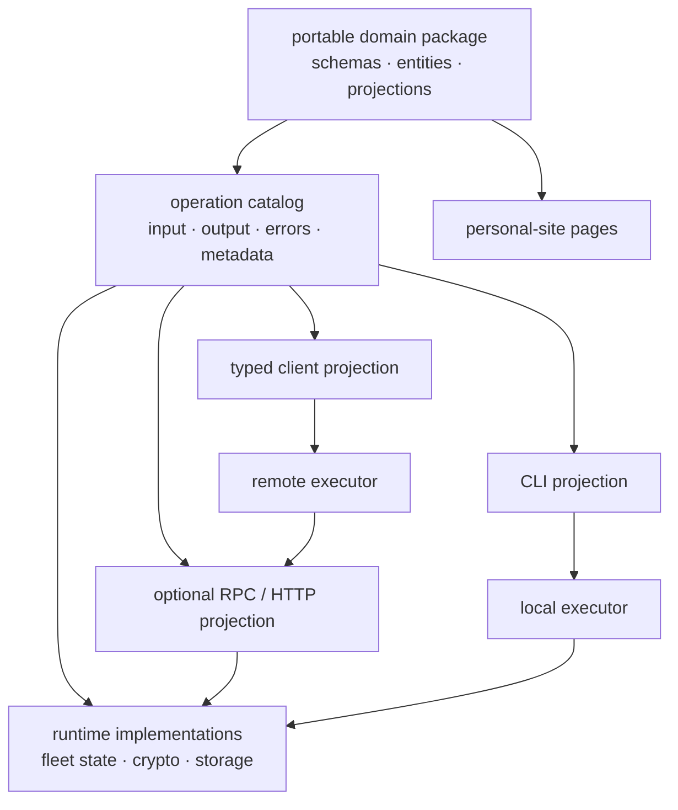
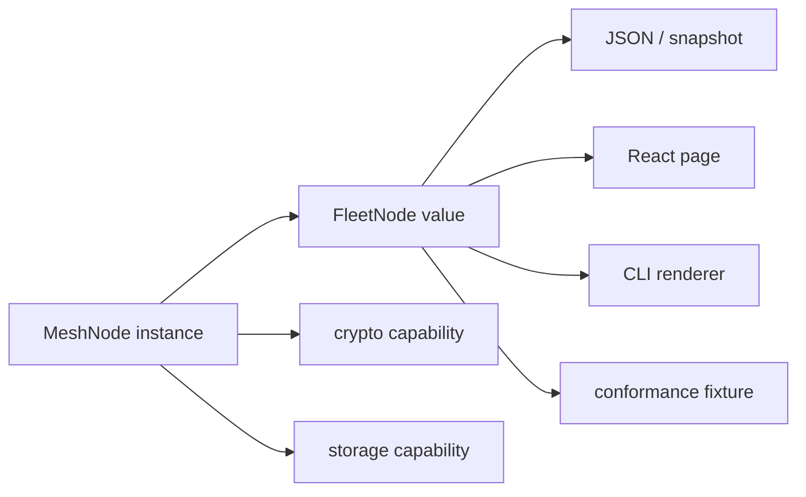
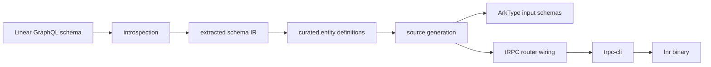
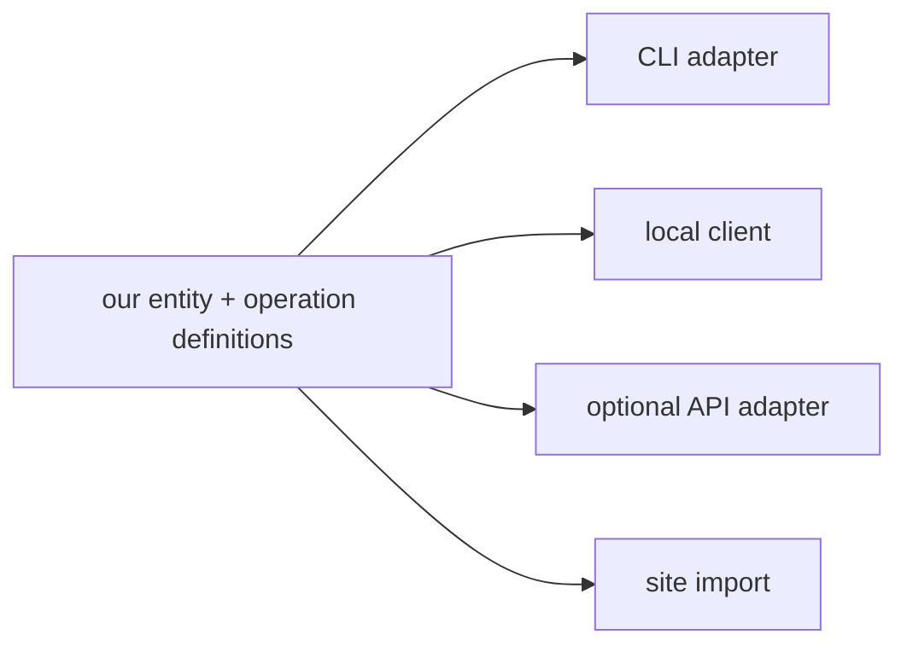
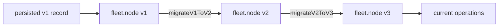
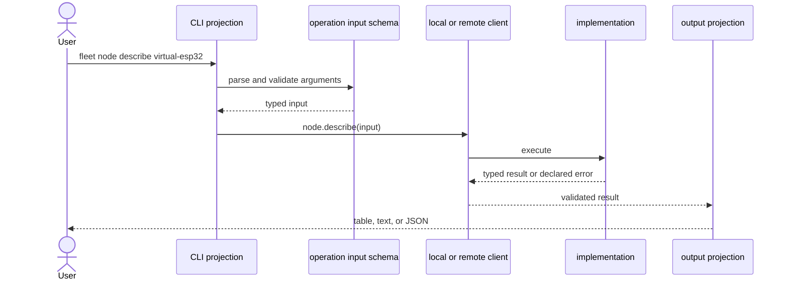
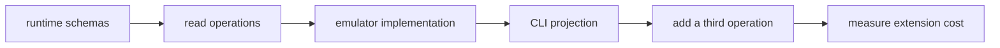

# portable entities, operations, and projections

status: local slice and first mmn deployment verified
scope: portable entities and operations in dots, beginning with fleet-mesh and
a projected local CLI. site integration, repository unification, and remote
transport are later consumers.

## intent

the goal is not primarily to choose a web or RPC framework. the goal is to
establish one portable description of personal-domain objects and the
operations available on them, then project that description into whichever
interface is useful:

- import validated entities and pure behavior into personal-site pages;
- invoke the same operations directly in simulators, tests, jobs, and local
  tools;
- derive a usable CLI instead of hand-wiring every command;
- expose the same operations remotely when an API is useful;
- preserve a path from the TypeScript fleet emulator to ESP-IDF conformance;
- let dots package and deploy these tools without becoming their domain model.



the architectural authority should be the portable model and operation
catalog. CLI, HTTP, React, and simulator integration are projections of that
authority.

> [!NOTE]
> **decision:** any application should be able to execute an operation locally
> when it can provide that operation's required capabilities. operating on a
> shared resource pool is a separate concern between the owning runtime and its
> client. transport and authorization must remain orthogonal adapters chosen
> case by case.

## working vocabulary

using separate names prevents “object” from silently meaning several different
things:

| term | meaning |
|---|---|
| entity | validated, serializable domain data such as a node, revision, command, or receipt |
| schema | runtime parser and the source of the entity's TypeScript type |
| projection | pure derived representation such as a node summary, status label, table row, or page view |
| operation | a named capability with input, output, declared failures, and optional interface metadata |
| implementation | code that performs an operation using runtime capabilities such as crypto, storage, or network access |
| executor/client | gives callers one operation-shaped API while deciding whether execution is local or remote |
| adapter | exposes operations through a CLI, HTTP/RPC, a site loader, a job runner, or another interface |

entities should normally be plain data rather than JavaScript class instances.
plain values survive JSON, persistence, worker boundaries, HTTP, fixtures, and
the eventual ESP32 implementation. classes remain appropriate for stateful
runtime implementations such as the existing `MeshNode`.



importing shared code is not the same as importing shared live state. a page
can import schemas, projections, and clients. current fleet state still needs
either loader data, a local browser runtime, or a remote executor.

> [!NOTE]
> **decision:** the first useful version is local and file-backed. its
> operations execute in the local process against local files. a web UI,
> personal-site integration, and convergence with html thingies are separate
> follow-up work.

## verified pre-implementation baseline

this section records the repository state that motivated the slice. later
implementation sections and `modules/fleet-mesh/README.md` describe the current
worktree after extraction.

### fleet-mesh is an executable reference model, not a portable package

**confidence:** VERIFIED

**evidence:**

- `modules/fleet-mesh/README.md:3-6` defines a transport-independent,
  delay-tolerant message plane.
- `modules/fleet-mesh/README.md:28-35` calls `fleet-mesh.ts` the protocol
  reference and identifies the ESP-IDF implementation and BLE transport as
  future ports.
- `modules/fleet-mesh/fleet-mesh.ts:24-106` declares revisions, commands,
  receipts, identities, snapshots, and reconciliation results as TypeScript
  interfaces.
- `modules/fleet-mesh/fleet-mesh.ts:249-430` implements the stateful
  `FleetAuthority` and `MeshNode` classes.
- `modules/fleet-mesh/lab.ts:13-49` runs `mbp-m2`, `lgo-z2e`, and
  `virtual-esp32` as a three-node HTTP lab.
- `modules/fleet-mesh/package.json:1-15` marks the package private and provides
  no exports, build entry, or browser entry.
- all current importers are within `modules/fleet-mesh`.

**falsification attempted:** repository-wide searches found no external
importer, package export, or separate browser entrypoint.

### the current module cannot be imported into a browser bundle as-is

**confidence:** VERIFIED

**evidence:**

- `modules/fleet-mesh/fleet-mesh.ts:1-14` imports `node:crypto`.
- `modules/fleet-mesh/fleet-mesh.ts:152-246` uses Node key objects and
  `Buffer` for signing, encryption, and decryption.
- `modules/fleet-mesh/tsconfig.json:6-13` targets Node types and emits nothing.
- `modules/fleet-mesh/fleet-mesh.ts:74-83` exports public and private identity
  material from the same module.

**falsification attempted:** no Web Crypto adapter, conditional browser
export, or crypto capability interface exists.

the portable package must not export private identities, Node built-ins,
filesystem behavior, daemon code, or stateful implementations from its
browser-safe entrypoints.

### current protocol shapes are compile-time interfaces, not runtime schemas

**confidence:** VERIFIED

**evidence:** the exported protocol records in
`modules/fleet-mesh/fleet-mesh.ts:24-106` are interfaces and unions. the daemon
currently relies on casts for parsed snapshots and gossip payloads before
cryptographic checks.

**falsification attempted:** no Zod, ArkType, Valibot, TypeBox, or other
runtime entity schema is present under `modules/fleet-mesh`.

runtime schemas would let the simulator, CLI, API, site, persisted snapshots,
and conformance fixtures reject malformed structure at their boundaries.

snapshot shape validation alone is not a semantic integrity check:

- `modules/fleet-mesh/daemon.ts:30-35` JSON-parses and casts a snapshot;
- `modules/fleet-mesh/fleet-mesh.ts:327-334` restores records, resources, and
  outcomes directly into private maps;
- restored derived state is not replayed or checked against signed records.

the first public read model must therefore use explicit runtime configuration,
not raw snapshot-derived state. deeper snapshot consistency becomes mandatory
before a later operation exposes resources, outcomes, or state-derived counts.

### current protocol identity depends on exact object shape

**confidence:** VERIFIED

**evidence:**

- `modules/fleet-mesh/fleet-mesh.ts:132-198` recursively canonicalizes objects
  for hashing, signing, verification, and encryption-key context;
- `modules/fleet-mesh/fleet-mesh.ts:173-186` hashes the signed command and
  receipt shapes to produce record ids;
- `modules/fleet-mesh/fleet-mesh.ts:270-289` signs and identifies the current
  command shape;
- `modules/fleet-mesh/fleet-mesh.ts:409-430` verifies ids and signatures
  against those exact fields.

**falsification attempted:** traced both issuance and verification. no
serialization whitelist removes newly added properties before canonicalization.
adding fields to a current signed value can therefore change its signature or
id and is not a schema-only refactor.

### the personal site already has the right workspace consumption pattern

**confidence:** VERIFIED

the sibling `igorbedesqui.com` checkout is already a pnpm workspace:

- `igorbedesqui.com/pnpm-workspace.yaml` includes `apps/*` and `packages/*`;
- `igorbedesqui.com/apps/web/package.json:21` consumes
  `@igorbedesqui/pattern-language` through `workspace:*`;
- the web app is a TanStack Start application and can use both browser modules
  and server functions.

the site currently has no shared runtime domain-schema package. its only local
workspace dependency is documentation-oriented.

### the intended architecture already exists in the pattern language

**confidence:** VERIFIED

- `igorbedesqui.com/packages/pattern-language/schema-derived-types.md:6-14`
  says to define a runtime schema once and derive its compile-time type.
- `igorbedesqui.com/packages/pattern-language/independently-invocable-units.md:15-20`
  says significant boundaries should be invocable as function calls, CLI
  pipes, or test fixtures without their host.
- `igorbedesqui.com/packages/pattern-language/workflow-equals-data.md:9-18`
  separates durable, inspectable records from the processes that operate on
  them.

this plan makes those existing patterns executable rather than introducing a
different philosophy.

## `lnr` as precedent

`github:bdsqqq/lnr` proves that schema-driven CLI generation is useful, but its
exact generator is not a requirement for this system.

### current `lnr` pipeline



**confidence:** VERIFIED

**evidence:**

- [`README.md:87-118`](https://github.com/bdsqqq/lnr/blob/main/README.md#L87-L118)
  describes schema introspection, generated commands, router wiring, and a
  hand-crafted UX layer.
- [`docs/adr/0001-schema-driven-cli-generation.md`](https://github.com/bdsqqq/lnr/blob/main/docs/adr/0001-schema-driven-cli-generation.md)
  records why manually maintaining schemas, router definitions, and mappings
  did not scale.
- [`docs/adr/0002-introspection-over-sdk-types.md`](https://github.com/bdsqqq/lnr/blob/main/docs/adr/0002-introspection-over-sdk-types.md)
  chooses GraphQL introspection because it preserves descriptions, enums, and
  deprecations.
- [`packages/codegen/extract-schema.ts`](https://github.com/bdsqqq/lnr/blob/main/packages/codegen/extract-schema.ts)
  turns Linear introspection into a smaller entity representation.
- [`packages/codegen/entity-schema.ts`](https://github.com/bdsqqq/lnr/blob/main/packages/codegen/entity-schema.ts)
  models whether an entity appears as a command, flag, scoped feature, or
  subcommand.
- [`packages/codegen/generate-commands.ts`](https://github.com/bdsqqq/lnr/blob/main/packages/codegen/generate-commands.ts)
  emits ArkType input schemas, handler imports, operation inference, and
  router code.
- [`packages/cli/src/cli.ts:21-28`](https://github.com/bdsqqq/lnr/blob/main/packages/cli/src/cli.ts#L21-L28)
  reduces the final CLI projection to `createCli({ router: appRouter })`.
- [`packages/cli/src/lib/command-introspection.ts`](https://github.com/bdsqqq/lnr/blob/main/packages/cli/src/lib/command-introspection.ts)
  reflects command documentation from router and schema metadata.

### lessons to retain

1. structural schemas and interface UX are different information.
   Linear knows what a `ProjectUpdate` is, but not whether humans should reach
   it through `project --updates`, a standalone command, or a subcommand.
2. generated files must not become hand-edited source.
   [`ADR-0007`](https://github.com/bdsqqq/lnr/blob/main/docs/adr/0007-entity-config-v2-exploration.md)
   traces how manual changes to generated files were overwritten and motivated
   a richer entity-definition layer.
3. unknown upstream entities should fail categorization rather than disappear
   silently.
4. human-friendly resolvers and output formatting remain intentional UX.
   schema generation removes mechanical plumbing, not product decisions.
5. operation inference and contradictory flag precedence warrant property
   tests. `lnr` already tests those invariants in
   `packages/cli/src/lib/operation-spec.test.ts`.

### what does not transfer directly

the fleet model is ours. it does not need GraphQL introspection, an extracted
third-party intermediate representation, or generated TypeScript merely to
recover information we authored ourselves.



source generation remains an option when it produces useful artifacts, but it
should not be the default if direct runtime reflection can preserve the same
authority.

> [!NOTE]
> **decision deferred:** runtime projection versus committed generated source
> does not block the first slice. if source is generated, prefer committing it
> for auditability and distribution, and keep it under an unmistakable
> generated namespace so it can be extracted into another repository later.

## `trpc-cli` as precedent, not a requirement

`trpc-cli` demonstrates that a procedure router plus inspectable schemas can
produce a capable CLI with little glue. current upstream `0.14.0` supports:

- tRPC routers;
- implemented oRPC routers, including contract-first implementations;
- nested routers as nested commands;
- Zod, ArkType, Valibot, Effect, and TypeBox inputs;
- schema descriptions, aliases, positional arguments, prompts, and completion;
- `--json` fallback when a complex schema cannot map cleanly to flags;
- an experimental mode that derives commands from plain exported TypeScript
  functions and classes.

sources:

- [upstream README](https://github.com/mmkal/trpc-cli/blob/main/README.md)
- [upstream oRPC tests](https://github.com/mmkal/trpc-cli/blob/main/test/orpc.test.ts)

`lnr` currently pins `trpc-cli@^0.12.2`, so its own implementation uses tRPC.
direct oRPC support is a newer upstream capability.

the implementation evaluation rejected it for the first adapter because its
no-input and JSON-output behavior conflicts with the settled acceptance
commands. the operation model remains independent of that decision.

> [!NOTE]
> **decision:** matching `lnr` command-for-command is not a requirement. the
> system should make that quality bar an incidental consequence of complete
> contracts, sound defaults, and projection metadata rather than bespoke work
> for every command.

## framework findings

### Standard Schema is necessary interoperability, not an operation model

Standard Schema standardizes inferred input/output types and runtime
validation. Standard JSON Schema standardizes conversion for tooling. neither
defines entities, procedures, CLI layout, execution, errors, or transport.

the portable schemas should use a library that provides:

- Standard Schema compatibility;
- reliable JSON Schema conversion for schemas whose constraints ArkType can
  represent faithfully;
- browser-safe runtime validation;
- descriptions and metadata;
- stable schema composition.

ArkType is selected because it is already proven in `lnr`, validates schema
definitions while they are authored, and keeps its syntax close to TypeScript.
Zod and Valibot remain evidence that Standard Schema preserves an adapter path
if this choice later becomes constraining.

ArkType `2.2.3` cannot faithfully convert the recursive exact `JsonValueV1`
schema used here. its structural string-indexed object branch also accepts
arrays, so runtime correctness requires a pure `.narrow()` that recursively
rejects unsafe integers and non-plain objects. `toJsonSchema()` cannot represent
that predicate and also fails while converting the containing snapshot
structure. runtime exactness outranks conversion with no current consumer.
defer JSON Schema for `JsonValueV1` and `MeshNodeSnapshotV1` until a named
consumer exists and ArkType can convert them faithfully. do not add a parallel
hand-authored JSON Schema authority or claim universal catalog conversion.

> [!NOTE]
> **decision:** use ArkType. its schema definitions are validated while being
> authored, its syntax stays close to TypeScript, it implements Standard
> Schema, and `lnr` already exercises its metadata and JSON Schema projection.

### oRPC is a strong operation substrate, not the entity authority

verified oRPC capabilities relevant to this plan:

- handler-free contracts declare input, output, typed errors, and metadata;
- `implement(contract)` type-checks implementations against those contracts;
- Standard Schema validators work for inputs, outputs, and error data;
- server-side clients call implemented routers locally while still running
  validation and middleware;
- remote clients use the same nested operation shape;
- RPC and OpenAPI handlers can expose the same router;
- custom metadata can carry CLI or other projection hints;
- oRPC can be mounted inside Elysia through its Fetch adapter if Elysia later
  provides useful server facilities.

official sources:

- [procedure contracts](https://orpc.dev/docs/contract/procedure)
- [contract implementation](https://orpc.dev/docs/contract/implementation)
- [server-side clients](https://orpc.dev/docs/client/server-side)
- [metadata](https://orpc.dev/docs/metadata)
- [OpenAPI specification](https://orpc.dev/docs/openapi/specification)
- [Elysia adapter](https://orpc.dev/docs/adapters/elysia)

oRPC v1 is stable. current v2 documentation is public beta. any implementation
must pin one major version and its matching documentation. current
`trpc-cli@0.14.0` upstream tests use oRPC v1.x.

### `trpc-cli@0.14.1` cannot preserve the settled CLI contract

the implementation gate found two concrete conflicts in the published npm
package:

1. `parseOrpcRouter` wraps a missing oRPC `inputSchema` in a one-element array.
   schema conversion then fails and `jsonProcedureInputs` exposes a synthetic
   `--input`, even though `node.list` has no input.
2. `run()` sends results through `logger.info`; the default
   `lineByLineLogger` emits top-level arrays item by item. there is no
   output-mode `--json` capable of emitting one stable JSON document.

patching both paths would retain the dependency while replacing its parsing and
output behavior. the first CLI therefore uses a small local projection instead.
`trpc-cli` remains a useful precedent, not a dependency.

### tRPC remains a viable low-novelty option

`lnr` already proves ArkType + tRPC + `trpc-cli` locally. tRPC v11 supports
Standard Schema validators, local callers, and remote web clients. its
trade-off is that implemented server routers, rather than independent
handler-free contracts, are the normal type authority. OpenAPI is less central
than in oRPC.

### plain functions remain the portability floor

plain functions with explicit dependencies are the smallest durable unit:

```ts
createProject(dependencies, input)
```

Zod's function schemas and similar helpers can validate local function input
and output, but remote calls, router reflection, middleware, typed transport
errors, and OpenAPI would remain manual.

actual business logic should remain callable beneath an RPC procedure where
doing so improves composition. one procedure should not call another through a
local RPC client merely to reuse logic; both should call the shared use case.

### classes are runtime implementations, not contracts

classes can group dependencies and state, as `MeshNode` does. they do not
inherently provide serializable contract metadata, runtime validation, CLI
projection, or remote clients. class instances also do not cross JSON or
process boundaries intact.

### Elysia is optional infrastructure

Elysia is a schema-aware HTTP framework whose Eden client derives types from an
implemented app. it is useful if Bun-oriented routing, lifecycle hooks,
WebSockets, or plugins become requirements. it does not solve portable entity
modeling or CLI projection, so it should not be an architectural authority.

## proposed boundaries

the working package split is conceptual until repository topology is chosen:

```text
@personal/fleet
├── entities
│   ├── revision
│   ├── public-identity
│   ├── command
│   ├── receipt
│   ├── node-summary
│   ├── node-description
│   └── schema-catalog
├── projections
│   ├── status
│   ├── display
│   └── conformance
├── operations
│   ├── node.list
│   ├── node.describe
│   ├── mesh.issue-set
│   ├── mesh.contact
│   └── mesh.snapshot
└── client types

@personal/fleet-node
├── MeshNode
├── FleetAuthority
├── NodeIdentity
├── LocalFleetRuntime
├── Node crypto
├── persistence
├── daemon
└── operation implementations

@personal/fleet-cli
├── operation-to-command projection
├── local/remote executor selection
└── output rendering
```

package names are placeholders. the first extraction should remain one
browser-safe package plus one Node runtime package; finer package fragmentation
is premature.

### browser-safe entity package

the package may contain:

- runtime schemas and schema-derived types;
- opaque or branded identifiers where useful;
- immutable protocol records;
- public summaries and projections;
- pure comparison, formatting, and state-transition helpers;
- handler-free operation definitions;
- client types.

it must not contain:

- private identities or credentials;
- `node:*` imports or `Buffer`;
- filesystem or daemon code;
- environment reads;
- stateful runtime singletons;
- implicit access to live fleet state.

### implementation package

the Node runtime may contain:

- key generation, signing, encryption, and decryption;
- persistent snapshots;
- transport adapters;
- authority and node state;
- operation handlers;
- local executor construction.

longer term, a `CryptoPort` could allow Node and Web Crypto implementations.
that asynchronous redesign is unnecessary unless browser-side simulation is a
confirmed requirement.

> [!NOTE]
> **decision:** the portable package is public, but private identities remain
> outside it and use the existing secrets boundary. contracts may expose a
> public identity or an opaque key reference; they must never return private
> key material. key storage and resolution belong to the local runtime.

## operation catalog requirements

an operation definition should be able to describe:

```ts
{
  id: "node.describe",
  version: 1,
  input: NodeIdV1Schema,
  output: FleetNodeDescriptionV1Schema,
  errors: {
    NODE_NOT_FOUND: NodeNotFoundV1Schema
  },
  metadata: {
    summary: "describe one fleet node"
  }
}
```

### versioned schemas and operations

every named/exported schema and every operation must have a stable identity
and an explicit version. anonymous fragments composed entirely inside a named
schema inherit that schema's version rather than becoming independent
artifacts. package semver is not a substitute: old records can outlive package
installations, and two schemas may evolve independently within one package
release.

schema identity does not require adding fields to every value. one exported
catalog is the authority:

```ts
export const fleetSchemaCatalog = {
  "fleet.revision": {
    1: RevisionV1Schema,
  },
  "fleet.node-summary": {
    1: FleetNodeSummaryV1Schema,
  },
} as const;
```

the catalog is keyed first by stable schema id and then by positive integer
version. exported variable names and scattered descriptions are not identity.
every named/exported schema appears exactly once. anonymous internal fragments
inherit their containing exported schema's catalog identity and version.

operations use separate oRPC metadata:

```ts
{
  id: "node.describe",
  version: 1,
  input: NodeIdV1Schema,
  output: FleetNodeDescriptionV1Schema,
}
```

requirements:

1. each catalog id or operation id is globally stable and human-readable;
2. each version is a positive integer scoped to that identifier;
3. new standalone persisted or wire values should carry in-value `kind` and
   `version` discriminators when that is part of their initial protocol;
4. contracts name the exact input, output, and error schema versions they use;
5. migrations are explicit, pure functions between adjacent versions;
6. parsing never silently treats an old value as the latest shape;
7. migration chains preserve fixtures for every historical version;
8. domain revisions such as `{ epoch, sequence }` remain distinct from schema
   versions;
9. package semver communicates package compatibility, not record identity;
10. CLI projections and local callers target the latest operation version by
    default unless a compatibility path is explicitly requested;
11. every migration emits an append-only receipt containing the migration id,
    source and target schema versions, source and target content hashes,
    timestamp, implementation/package version, and outcome;
12. a lossy migration records an immutable pre-migration snapshot reference.
    hashes alone prove identity but cannot restore discarded information.

existing fleet protocol v1 is the compatibility exception to requirement 3.
its schema id and version live in catalog metadata unless the current value
already carries them. adding a discriminator to an existing command, receipt,
revision, public identity, mesh record, or snapshot would change persisted
bytes and, for signed fields, command or receipt identity. such additions
require an explicit protocol v2 migration.

v1 compatibility also retains Node's permissive base64 decoding for signature
text. unpadded variants accepted by the original verifier remain accepted when
their record id matches that exact text. canonical signature encoding is a
protocol v2 hardening, not a v1 extraction change.



> [!NOTE]
> **decision:** do not preserve the original value beside every migrated value.
> use deterministic adjacent-version migrations, immutable historical
> fixtures, and exhaustive append-only migration receipts. when a migration is
> lossy, its receipt must reference an immutable pre-migration snapshot;
> deterministic code and hashes alone cannot recover discarded information.

### protocol v1 wire and validation invariants

the extraction must preserve every valid existing protocol v1 value
byte-for-byte. `canonicalJson` covers command ids, receipt ids, signatures,
command-header additional authenticated data, and the HKDF context. validation
therefore observes the original value; it does not normalize it.

v1 ArkType schemas and boundary helpers must:

1. reject unknown fields and malformed nested structures;
2. use no morphs, defaults, coercion, key deletion, or reconstruction;
3. leave the input reference and its contents unchanged;
4. discard any validator-produced representation and pass the original value
   into canonicalization, signature verification, decryption, and ingestion;
5. encode the existing recursive safe-integer rule for `JsonValue`, revisions,
   and every other v1 numeric field without adding positivity constraints that
   v1 did not have;
6. validate cleartext `JsonValue` before canonicalization, signing, or
   encryption, and validate decrypted JSON immediately after decryption before
   inserting it into runtime state.

encrypted application values cannot be validated before decryption. this is
not permission to defer validation at cleartext boundaries.

one shared assertion-shaped helper owns untrusted record validation:

```ts
validateV1MeshRecord(value: unknown): asserts value is MeshRecordV1
```

HTTP request bodies, peer HTTP responses, snapshot loading, and every future
transport adapter must call it without casting around failure. `MeshNode.ingest`
remains a trusted, typed Node-runtime method for already validated records and
in-process callers.

immutable current-v1 conformance fixtures must lock command and receipt ids,
signatures, canonical behavior, object identity and content, and unknown-field
rejection before extraction changes the implementation.

the first representation is an oRPC contract. the vertical slice tests that
choice against the requirements below. entities and use-case functions remain
independent so a later neutral `defineOperation()` descriptor or another
library does not require rewriting the domain.

required properties:

1. schemas remain directly importable without implementations;
2. implementation completeness is type-checked;
3. local and remote callers receive the same operation shape;
4. inputs and outputs are validated at external boundaries;
5. expected domain failures are declared and serializable;
6. arbitrary projection metadata can be attached;
7. adapters can enumerate nested operations without private internal APIs;
8. transport-specific metadata does not contaminate entity schemas.

> [!NOTE]
> **decision:** begin with oRPC contracts as the operation catalog. keep entity
> schemas and use-case functions independent of oRPC so a later migration does
> not require rewriting data definitions or business logic.

## CLI projection

schema shape alone cannot determine a humane CLI. the projection may need:

- command path, aliases, summary, and examples;
- positional arguments versus options;
- string coercion and repeated-value syntax;
- nested object and file/stdin handling;
- config, environment, and argument precedence;
- secret prompting and output redaction;
- destructive-operation confirmation;
- local versus remote execution support;
- output format and table columns;
- domain-error to exit-code mapping.

the default convention should minimize required metadata:

| contract shape | default CLI projection |
|---|---|
| nested operation path | nested command path |
| scalar or tuple input | positional arguments |
| flat object input | kebab-case options |
| descriptions | help text |
| booleans | switches |
| arrays | repeated or variadic values where unambiguous |
| complex or unsupported input | `--json` or stdin |
| serializable output | JSON by default |

domain-specific metadata should override these defaults. `lnr` shows that
resolvers, operation inference, and output design cannot always be inferred.

> [!NOTE]
> **decision:** do not use or patch `trpc-cli@0.14.1`. its oRPC adapter turns an
> absent input schema into `[undefined]`, falls back to a synthetic
> `--input [json]`, and cannot preserve a genuine no-input operation. its
> default logger also flattens top-level arrays and has no JSON-output
> `--json`. implement a small local projection over the public oRPC operation
> catalog and local client instead. keep it bounded to current requirements;
> this is not authorization for a general CLI framework.

operation and input-schema identities belong to oRPC and schema-catalog
metadata, not synthetic input fields. `node.list` has no input.
`node.describe` accepts one scalar node id. do not use schema defaults or CLI
adapter tricks to hide literal `kind` or `version` fields; those fields are not
part of either input. this preserves the acceptance form:

```console
fleet node describe virtual-esp32
```

the local projection must enumerate operations through public oRPC APIs and
invoke the same local client used by non-CLI callers. it may interpret explicit
operation metadata for command names, summaries, and input mode. it must not
redeclare domain schemas, use cases, error payloads, or a second operation
router. stop if public oRPC APIs cannot support enumeration and invocation
without duplicated wiring.



## future site projection

the site should import the browser-safe package through normal package exports:

```ts
import {
  FleetNode,
  nodeStatusLabel,
  type FleetClient
} from "@personal/fleet"
```

three site modes should remain possible:

1. **static/read model:** parse loader data and render entities;
2. **remote operations:** use a typed client against an API;
3. **server-local operations:** a TanStack Start server function constructs a
   local executor if the fleet implementation is deployed with the site.

the browser must not accidentally bundle the Node runtime. explicit subpath
exports and a browser-import smoke test should enforce this.

## repository and distribution topology

today, dots and the personal site are separate Git repositories and separate
package workspaces. `workspace:*` cannot cross that boundary.

### option A: one monorepo

```text
personal-platform/
├── apps/
│   ├── site
│   └── fleet-cli
├── packages/
│   ├── fleet
│   └── fleet-node
└── nix/
```

**gains:** atomic changes, `workspace:*`, one CI graph, easy source-level
development.

**costs:** repository migration, coupled histories and release workflows, a
larger checkout for unrelated work.

### option B: separate repositories plus a versioned package

the canonical browser-safe package is published as compiled ESM and
declarations. dots, the site, and other consumers pin a version.

**gains:** independent repositories and deployments, realistic consumer
boundary, explicit compatibility.

**costs:** package publication and versioning, slower cross-repository
iteration, registry configuration when private.

### option C: sibling `file:` or `link:` dependency

acceptable only for an exploratory local spike. it is not durable because CI,
Vercel, and other clean checkouts do not contain the sibling path.

before selecting A or B, pack the browser-safe package and install the tarball
into a clean site checkout. that validates package exports and browser safety
without committing to a repository migration.

> [!NOTE]
> **decision deferred:** physical repository unification is likely, but it is
> outside the first slice. keep new packages clearly namespaced and
> extractable so that decision does not require an architectural rewrite.

> [!NOTE]
> **decision:** portable schemas, public entities, operation contracts, and
> generated interfaces are public. inventory-specific secrets and private
> identities remain behind the existing secrets boundary.

## proposed first vertical slice

the first slice should prove the boundary rather than build a general personal
object framework.

### 1. extract browser-safe runtime schemas

start with:

- `JsonValue`;
- `Revision`;
- `PublicIdentity`;
- `CommandEnvelope`;
- `ReceiptEnvelope`;
- `MeshRecord`;
- `MeshNodeSnapshot`;
- a new public `FleetNodeSummary`;
- a new public `FleetNodeDescription`;
- `NodeNotFound`.

derive TypeScript types from these schemas and register every exported schema
in `fleetSchemaCatalog`. preserve all existing protocol v1 value shapes. only
the new read models and error payloads introduce new in-value discriminators.
keep `NodeIdentity`, `FleetAuthority`, `MeshNode`, crypto, snapshot loading,
and the runtime node catalog in the Node runtime.

the initial read models are exact:

```ts
type FleetNodeSummaryV1 = {
  kind: "fleet.node-summary";
  version: 1;
  id: string;
  fleet: string;
};

type FleetNodeDescriptionV1 = {
  kind: "fleet.node-description";
  version: 1;
  fleet: string;
  identity: PublicIdentityV1;
};

type NodeNotFoundV1 = {
  kind: "fleet.node-not-found";
  version: 1;
  id: string;
};
```

do not add connectivity status, daemon URLs, state paths, resource names or
values, record/resource/outcome counts, last-seen data, or private key material
to version 1.

### 2. define two read operations

start with low-risk operations:

- `node.list`;
- `node.describe`.

declare input, output, not-found failure, descriptions, and minimal CLI
metadata. `node.list` takes no input and returns summaries sorted by id using
deterministic JavaScript code-unit ordering, not locale-sensitive comparison.
`node.describe` takes a scalar node id and returns a description. its declared
oRPC error code is `NODE_NOT_FOUND`; its exact data payload is
`NodeNotFoundV1`, with no message or optional fields inside the typed payload.
do not begin with credential mutation or command issuance.

### 3. implement against the current emulator

introduce an explicit Node-runtime-owned `LocalFleetRuntime`, scoped to one
configured fleet. its node catalog enumerates configured entries; it does not
inspect a node's private roster, glob snapshot files, or infer inventory from
instantiated classes. each entry binds public configuration, a state path, and
a successfully loaded `MeshNode`.

catalog construction is atomic and fail-closed. any duplicate node id, exact
configured-versus-runtime public identity mismatch, malformed existing
snapshot, non-`ENOENT` read error, or node construction failure rejects the
whole runtime. never expose partial inventory. a missing snapshot is a valid
fresh node only when the state path belongs to an explicitly configured entry;
`ENOENT` is the sole missing-state case that does not fail construction.

compare configured `id`, `signingPublicKey`, and `encryptionPublicKey` as exact
strings against an explicit `publicIdentity(node.identity)` projection before
exposing the runtime. never return or spread `MeshNode.identity`: its current
`NodeIdentity` includes private keys.

portable use cases receive only a narrow reader capability for `list` and
`describe`. both operations derive fields from catalog configuration, not raw
snapshots or `MeshNode` internals. snapshot parsing and loading remain trusted
Node-runtime responsibilities and must complete before an entry is readable.
ArkType must exact-validate snapshot structure and its records before
construction.

structural validation does not prove that snapshot `resources` and `outcomes`
are cryptographically and relationally consistent with its records. slice 1
therefore exposes no snapshot-derived fields. before a later operation relies
on those values, add either complete consistency verification or a
semantics-preserving rebuild policy; do not treat an ArkType pass alone as
proof of derived-state integrity.

call the use cases directly in tests and through one local oRPC client.

### 4. project a CLI

implement a small local adapter over the public oRPC operation catalog and
local client. support only the settled no-input and scalar-positional input
modes plus help and JSON output. `--json` is an output mode and emits exactly
one stable JSON document, including one array document for `node.list`. never
add an input flag to a no-input operation. the acceptance criterion is:

```console
fleet node list --json
fleet node describe virtual-esp32
```

both commands must use the same operation definitions as other callers.
help and argv tests must prove that `node.list` has no `--input`, while output
tests parse its `--json` result as one array.

### 5. prove extension cost

`node.exists` is the third read operation. its measured hand-authored
production touch points are:

1. `fleet-schema.ts` for `FleetNodePresenceV1` and its catalog entry;
2. `fleet-contract.ts` for the operation and scalar-input metadata;
3. `fleet-operations.ts` for the plain use case;
4. `fleet-router.ts` for the implementation binding.

tests changed in `fleet-schema.test.ts`, `fleet-operations.test.ts`, and
`fleet-cli.test.ts`. `fleet-cli.ts` required no operation-specific wiring;
public oRPC traversal discovered and invoked the new operation. because the
measurement was captured within the initial implementation work unit, this is
a static touch-point measurement rather than a commit-to-commit measurement.

the resulting workflow is:

1. add or reuse versioned schemas;
2. declare the versioned operation;
3. implement its use case;
4. regenerate or reflect projections;
5. receive CLI help, input validation, client types, and tests from those
   definitions.

the architecture is not validated merely because two initial commands work. it
is validated when adding the third operation is predictable and does not
require discovering hidden wiring.

### 6. defer site and remote projections

the package boundary should remain browser-safe, but personal-site consumption,
html thingies, repository convergence, and remote RPC/HTTP execution are
separate follow-up slices. the first implementation remains local and
file-backed.



> [!NOTE]
> **decision:** `node.list` and `node.describe` are sufficient initial
> operations. the decisive acceptance test is adding a third operation after
> the machinery exists and measuring the required changes.

## real deployment slice

the first physical deployment remains one host with three logical nodes. mmn
supervises all three; mbp and lgo run no fleet daemon.

### 1. separate public and private configuration

each daemon consumes one public Nix-store configuration containing the fleet,
public authority, complete public roster, loopback listener, durable state
path, explicit peers, and bounded contact timing. it separately consumes one
SOPS-produced `0400` file containing exactly one `NodeIdentity`. no launchd job
receives the authority private key or another node's identity.

### 2. supervise three loopback daemons on mmn

launchd runs `mmn-m4` on port 43120, `relay` on 43121, and
`virtual-esp32` on 43122. all listeners are fixed to `127.0.0.1`; configuration
validation rejects public binds, missing peers, roster drift, duplicate ids,
private/public key mismatch, invalid key algorithms, and invalid key pairs.

### 3. preserve tailnet-only reachability

the bridge is the sole externally reachable daemon. the repository's tailnet
app catalog and registry publish its `/` route through the owner-only
`svc:fleet-mesh` Tailscale Service. `/health` exposes only the protocol kind,
version, and logical node id. `/state` is not an API. relay and
`virtual-esp32` remain loopback-only.

### 4. contact explicit peers autonomously

the bridge contacts only `relay`; `relay` contacts the bridge and
`virtual-esp32`; `virtual-esp32` contacts only `relay`. each process permits
one contact round at a time, bounds contact duration, bounds gossip bodies, and
continues after peer-specific transient failures. shutdown cancels active
contacts, drains the current round, closes the listener, and atomically
persists the final snapshot.

### 5. prove relay, durability, and replay

the executable proof injects one authority-signed fixture command at the
bridge's existing gossip boundary. autonomous contact must carry that exact
record through the relay, apply it once on `virtual-esp32`, and return the
node-signed receipt to the bridge. after stopping and reconstructing the
virtual node from its snapshot, another relay contact must preserve the
resource, receipt, and durable execution count of one.

local schema, runtime, package, and topology checks precede deployment. the
mandatory `darwinConfigurations.mmn-m4.system` dry-run/full build and the
authorized live proof run on mmn because the current workstation lacks safe
Nix store headroom; no local garbage collection is authorized.

the 2026-09-02 deployment passed both remote builds and activated all three
loopback launchd daemons. SOPS produced three exact `0400` identity files, and
the system tailnet-registry daemon published `/` through `svc:fleet-mesh` to
port 43120. one live authority-signed command crossed bridge, relay, and
`virtual-esp32`; it applied once and returned the same signed receipt after the
virtual process restarted. snapshot replay preserved `executions = 1`. a stale
user-domain registry job was unloaded and removed so the system daemon remains
the sole registry lock owner.

## deferred work

defer until the first slice produces evidence:

- a generic `defineEntity()` framework;
- browser Web Crypto support;
- complete CRUD inference;
- generated OpenAPI;
- JSON Schema projection for recursive `JsonValueV1` and
  `MeshNodeSnapshotV1`;
- a public hosted fleet API;
- remote execution and authorization;
- personal-site consumption;
- convergence with html thingies;
- automatic React hooks or components;
- a generalized adapter shared with `lnr`;
- a general-purpose CLI projection framework beyond the local no-input and
  scalar-positional requirements;
- moving either repository;
- ESP-IDF code generation;
- mutation operations involving Wi-Fi credentials;
- canonical signature-text encoding and rejection of v1-compatible unpadded
  base64 variants;
- universal CLI table rendering.

after a second domain adopts the same operation model, compare both usages and
extract only the stable shared mechanics.

## verification strategy

each boundary should have an executable check:

### contracts and entities

- malformed structures fail runtime parsing;
- protocol v1 schemas reject unknown fields without morphing, defaulting,
  coercing, stripping, reconstructing, or mutating the input;
- every exported schema appears under its stable id and version in the one
  exported schema catalog;
- recursive `JsonValue` numbers and all other v1 numeric fields reject values
  outside JavaScript's safe-integer range;
- schema-derived types compile without duplicate interfaces;
- public exports contain no private key fields;
- JSON round-trips preserve exact protocol value shape and canonical signed
  bytes;
- ordinary non-recursive schemas such as `RevisionV1` retain faithful JSON
  Schema conversion;
- no public catalog or API claims that every ArkType schema is currently
  JSON-Schema-convertible.

### package boundary

- `pnpm pack` includes only declared exports;
- installation into a clean consumer succeeds;
- browser import rejects any `node:` dependency;
- a minimal browser build succeeds using the packed package;
- server-only exports cannot be imported from browser entrypoints.

### operation behavior

- every declared operation has an implementation;
- local inputs and outputs are validated;
- declared domain failures preserve their typed payloads;
- `NODE_NOT_FOUND` contains exactly `kind`, `version`, and the requested `id`;
- `node.list` is deterministic under code-unit id ordering;
- duplicate ids, identity mismatches, malformed snapshots, and construction
  failures prevent the entire local runtime from becoming available;
- a missing snapshot creates a fresh node only for an explicit catalog entry
  and only after an `ENOENT` result;
- summaries and descriptions contain no snapshot-derived or private fields;
- business logic remains independently callable beneath transport handlers.

when remote execution enters scope, add local/remote parity tests against the
same operation fixtures.

### CLI projection

- generated help snapshots are reviewed;
- command names and aliases are unique;
- positional and option mappings are deterministic;
- `node.list --help` contains no `--input`;
- no-input operations reject positional input;
- scalar operations accept exactly one positional value;
- `--json` controls output rather than input and emits exactly one JSON
  document; list output parses as one array rather than line-delimited items;
- unsupported input modes fail projection explicitly rather than disappearing
  or gaining a generic JSON-input escape hatch;
- contradictory operation flags have tested precedence;
- JSON output is stable for scripts;
- sensitive values never appear in help, logs, or output.

### fleet conformance

- existing protocol tests remain green;
- immutable pre-extraction fixtures retain identical command and receipt ids,
  signatures, canonical behavior, object references, and object contents;
- extracted schemas accept all valid existing conformance fixtures unchanged;
- unknown fields and malformed records fail through the shared assertion helper
  at HTTP request, peer-response, and snapshot boundaries before
  cryptographic processing;
- cleartext values fail safe-integer validation before encryption, while
  decrypted values fail validation before runtime state insertion;
- direct typed `MeshNode.ingest` callers and validated adapter paths retain
  existing protocol behavior;
- TypeScript and eventual ESP-IDF implementations consume shared vectors rather
  than attempting to share runtime code.

## captured decisions

| concern | decision |
|---|---|
| execution model | any app may execute operations locally when it supplies the required capabilities |
| shared resources | transport and authorization are orthogonal, case-specific concerns |
| first state authority | local files owned by the local process |
| schema library | ArkType |
| schema identity | every named/exported schema is keyed by stable id and explicit version in one exported schema catalog |
| legacy wire compatibility | existing fleet protocol v1 values remain byte-for-byte unchanged; missing in-value identity stays catalog metadata until protocol v2 |
| validation semantics | exact and observational: reject unknowns, never normalize, and pass original values into crypto |
| numeric semantics | all v1 numbers retain the existing recursive safe-integer invariant |
| operation identity | every operation has a stable id and explicit version |
| migration provenance | deterministic adjacent migrations, historical fixtures, append-only receipts, and snapshot references for lossy changes |
| operation catalog | begin with oRPC; preserve an exit through independent entities and use cases |
| CLI quality | strong defaults should make quality incidental rather than repeatedly hand-built |
| first CLI adapter | small local projection over public oRPC enumeration and the shared local client; no `trpc-cli` patch or dependency |
| initial CLI inputs | `node.list` has no input; `node.describe` takes one scalar node id |
| CLI JSON | `--json` is output-only and emits exactly one stable JSON document |
| generated source | deferred; lean committed and clearly namespaced if generation is used |
| repository topology | likely unified later, but explicitly outside the first slice |
| package visibility | public |
| private identities | remain behind the existing secrets/runtime boundary |
| first operations | `node.list` and `node.describe` |
| node inventory | one atomic, fail-closed runtime catalog over explicitly configured nodes |
| fresh state | only `ENOENT` for an explicit catalog entry creates a fresh node |
| list determinism | code-unit lexical ordering by node id |
| not-found data | exactly `{ kind: "fleet.node-not-found", version: 1, id }` |
| snapshot read model | no derived snapshot state is public until its cryptographic and relational consistency is proven |
| architectural acceptance | add a third operation and measure extension cost |
| web/site work | deferred to the separate site/html-thingy convergence effort |

## implementation gates

no unresolved architectural question blocks the first slice. implementation
should still stop and reassess at three evidence gates:

1. **on adapter conflict:** if ArkType, oRPC, or the local CLI projection cannot
   preserve any protocol, validation, contract, or CLI requirement above, stop
   and report the concrete API conflict. in particular, stop if operation
   enumeration or invocation would require private oRPC APIs or duplicated
   domain wiring. do not silently weaken a requirement or add a normalization
   layer.
2. **after the third operation:** count hand-authored touch points and verify
   that the CLI remains a projection rather than a second source of domain or
   contract design.
3. **before the first schema upgrade:** implement and test migration receipts,
   immutable historical fixtures, and pre-migration snapshot references for
   lossy changes. version `1` definitions do not justify speculative migration
   machinery before an actual version `2` exists.

## working recommendation

1. make the browser-safe ArkType entity package and its one exported schema
   catalog authoritative for data shape and schema identity;
2. preserve existing protocol v1 values exactly; use catalog metadata where
   adding an in-value discriminator would alter the protocol;
3. validate untrusted v1 values exactly and observationally through one shared
   assertion helper before they enter typed runtime code;
4. define versioned, handler-free oRPC contracts as the first operation
   catalog;
5. retain plain use-case functions over a narrow node-reader capability beneath
   oRPC implementations;
6. construct one atomic, fail-closed `LocalFleetRuntime` from explicit node
   configuration and locally owned files;
7. expose only configuration-derived node summaries and descriptions in the
   first read model;
8. use a bounded local CLI projection over the public oRPC catalog and shared
   local client;
9. derive richer CLI behavior through conventions plus explicit metadata only
   when concrete needs appear;
10. treat `lnr` as the precedent for those future UX layers, not as code that
   must be generalized now;
11. commit generated source only if generation is chosen, and isolate it under
   an unmistakable namespace;
12. keep private keys and Node runtime behavior outside public portable exports;
13. validate extensibility by adding a third operation after the initial two;
14. stop and report any concrete ArkType, oRPC, or local-projection conflict
    rather than weakening an invariant or using private APIs;
15. defer site, remote transport, authorization, and repository unification;
16. generalize only after fleet and one other domain demonstrate the same
    pattern.
