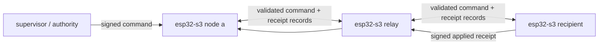

# fleet mesh esp32-s3 firmware

this directory is a standalone ESP-IDF application pinned to ESP-IDF `v5.5.2`.
it runs one bounded v1 mesh node over QEMU's OpenEth device. it does not issue
commands. a supervisor remains the only component allowed to originate an
authority-signed command.



## build pin

use the exact release rather than a moving ESP-IDF branch. the managed component
manifest pins `espressif/libsodium` to `1.0.22~1` and rejects another IDF version.

```bash
git clone --branch v5.5.2 --recursive https://github.com/espressif/esp-idf.git "$HOME/src/esp-idf-v5.5.2"
"$HOME/src/esp-idf-v5.5.2/install.sh" esp32s3
. "$HOME/src/esp-idf-v5.5.2/export.sh"
cd modules/fleet-mesh/firmware
idf.py set-target esp32s3
idf.py build
python3 tools/check.py
```

`CONFIG_ETH_USE_OPENETH=y` is set in `sdkconfig.defaults`. networking uses
`esp_eth_mac_new_openeth`, a DP83848 PHY, `esp-netif`, and DHCP. the guest serves
plain HTTP on port 80:

- `GET /health` returns the node id;
- `POST /gossip` accepts a JSON array of v1 records and returns
  `{"accepted":n,"records":[...]}`.

plain HTTP is intentional only for the QEMU/lab transport. it does not provide
peer authentication or confidentiality for envelope metadata. command payloads
remain encrypted, and every relayed record is validated cryptographically.

after DHCP, `fm_clock` synchronizes UTC from the compile-time
`CONFIG_FLEET_TIME_SERVER` using ESP-IDF's SNTP service. HTTP and opaque relay
remain available while time is unavailable, but recipient commands stay pending:
the node does not apply state or create a signed receipt until the first
successful synchronization. the peer loop retries pending commands locally, so
`notBefore` does not depend on another successful gossip response.

the default server is Cloudflare's numeric anycast endpoint
`162.159.200.1`, avoiding a DNS dependency in Espressif QEMU, with ESP-IDF's
hourly resynchronization. SNTP does not authenticate time. this baseline assumes
the device's network and configured time path are inside the deployment trust
boundary; temporal commands need an authenticated time provider before use on
hostile networks. existing signed receipts retain their original timestamps.

## provision contract

`partitions.csv` describes one 4 MiB flash image:

| partition | type/subtype | fixed offset | exact size |
|---|---|---:|---:|
| `nvs` | data/nvs | `0x009000` | `0x006000` |
| `phy_init` | data/phy | `0x00f000` | `0x001000` |
| `factory` | app/factory | `0x010000` | `0x200000` (2 MiB) |
| `fleet_state` | data/nvs | `0x210000` | `0x040000` (256 KiB) |
| `fleet_cfg` | data/custom subtype `0x40` | `0x250000` | `0x010000` (64 KiB) |

`fleet_cfg` is immutable provisioning input. its first four bytes are the JSON
byte length as an unsigned little-endian `uint32`. exactly that many following
bytes are UTF-8 JSON. every remaining byte through offset `0x25ffff` MUST be
`0xff`; boot fails closed otherwise.

its JSON object has exactly these fields:

```json
{
  "version": 1,
  "fleet": "home",
  "authority": { "id": "fleet-admin", "publicKey": "<canonical Ed25519 SPKI PEM>" },
  "identity": {
    "id": "node-a",
    "signingPublicKey": "<canonical Ed25519 SPKI PEM>",
    "encryptionPublicKey": "<canonical X25519 SPKI PEM>",
    "signingPrivateKey": "<canonical Ed25519 PKCS8 PEM>",
    "encryptionPrivateKey": "<canonical X25519 PKCS8 PEM>"
  },
  "roster": [
    {
      "id": "node-a",
      "signingPublicKey": "<same node-a Ed25519 SPKI PEM>",
      "encryptionPublicKey": "<same node-a X25519 SPKI PEM>"
    },
    {
      "id": "relay",
      "signingPublicKey": "<relay Ed25519 SPKI PEM>",
      "encryptionPublicKey": "<relay X25519 SPKI PEM>"
    }
  ],
  "peers": [{ "id": "relay", "url": "http://10.0.2.2:18082" }],
  "contactIntervalMs": 1000,
  "contactTimeoutMs": 500
}
```

this is the exact object
`{version:1,fleet,authority,identity,roster,peers,contactIntervalMs,contactTimeoutMs}`.
unknown fields are rejected at every level. `identity` is the sole private node
identity and has exactly the five shown fields. authority, roster, and peers are
public. the local identity must exactly match one roster entry. peers must be
explicit, unique, non-local roster members represented as HTTP origins without
a trailing slash.

only canonical RFC8410 encodings are accepted:

- Ed25519 SPKI DER prefix `302a300506032b6570032100`;
- X25519 SPKI DER prefix `302a300506032b656e032100`;
- Ed25519 PKCS8 DER prefix `302e020100300506032b657004220420`;
- X25519 PKCS8 DER prefix `302e020100300506032b656e04220420`.

PEM text must match Node's one-line 64-column output exactly, including the final
newline. public/private pairs are derived and compared at boot. wire ephemeral
keys use the same canonical X25519 SPKI PEM.

create a partition image without rewriting or normalizing the JSON bytes:

```bash
python3 tools/provision.py /secure/node-a.json build/node-a-fleet_cfg.bin
```

`fleet_state` is a separate NVS partition. one committed snapshot contains the
validated record set, exact decrypted UTF-8 resource bytes (base64-wrapped only
inside the snapshot), command outcome, receipt id, and execution count. one NVS
commit makes a simulated resource update and its signed receipt durable
together. corrupt or incompatible state fails boot and is never auto-erased.
replaying a command with a durable outcome therefore leaves its execution count
at one.

the QEMU supervisor upgrades a changed firmware image by atomically replacing
the executable flash regions while copying the exact `fleet_state` partition
bytes into the new image. it then rewrites immutable `fleet_cfg`. incompatible
snapshot data still fails closed in the new firmware rather than being erased.

## merge three guest images

build once, create three configurations, then merge three independent flash
images. each configuration needs its own five-field private identity and the
same authority and public roster. these example peer URLs form `node-a -> relay`,
`relay -> node-a, node-c`, and `node-c -> relay`; each guest reaches another
QEMU user-network forward through `10.0.2.2`.

```bash
python3 tools/provision.py /secure/node-a.json build/node-a-fleet_cfg.bin
python3 tools/provision.py /secure/relay.json build/relay-fleet_cfg.bin
python3 tools/provision.py /secure/node-c.json build/node-c-fleet_cfg.bin

esptool.py --chip esp32s3 merge_bin --flash_mode dio --flash_freq 80m --flash_size 4MB \
  -o build/node-a-flash.bin \
  0x0 build/bootloader/bootloader.bin \
  0x8000 build/partition_table/partition-table.bin \
  0x10000 build/fleet-mesh-esp32s3.bin \
  0x250000 build/node-a-fleet_cfg.bin
esptool.py --chip esp32s3 merge_bin --flash_mode dio --flash_freq 80m --flash_size 4MB \
  -o build/relay-flash.bin \
  0x0 build/bootloader/bootloader.bin \
  0x8000 build/partition_table/partition-table.bin \
  0x10000 build/fleet-mesh-esp32s3.bin \
  0x250000 build/relay-fleet_cfg.bin
esptool.py --chip esp32s3 merge_bin --flash_mode dio --flash_freq 80m --flash_size 4MB \
  -o build/node-c-flash.bin \
  0x0 build/bootloader/bootloader.bin \
  0x8000 build/partition_table/partition-table.bin \
  0x10000 build/fleet-mesh-esp32s3.bin \
  0x250000 build/node-c-fleet_cfg.bin
```

`merge_bin` fills unspecified bytes with `0xff`, so every guest starts with an
erased `fleet_state`. preserve each flash file between restarts to test durable
apply-once behavior.

## run three QEMU guests

use Espressif's `qemu-system-xtensa` build with ESP32-S3 support. run each command
in a separate terminal:

```bash
qemu-system-xtensa -nographic -machine esp32s3 \
  -drive file=build/node-a-flash.bin,if=mtd,format=raw \
  -nic user,model=open_eth,hostfwd=tcp:127.0.0.1:18081-:80

qemu-system-xtensa -nographic -machine esp32s3 \
  -drive file=build/relay-flash.bin,if=mtd,format=raw \
  -nic user,model=open_eth,hostfwd=tcp:127.0.0.1:18082-:80

qemu-system-xtensa -nographic -machine esp32s3 \
  -drive file=build/node-c-flash.bin,if=mtd,format=raw \
  -nic user,model=open_eth,hostfwd=tcp:127.0.0.1:18083-:80
```

```bash
curl --fail http://127.0.0.1:18081/health
curl --fail http://127.0.0.1:18082/health
curl --fail http://127.0.0.1:18083/health
```

contacts are sequential in configured peer order. every contact has the explicit
`contactTimeoutMs`; a DNS, connect, HTTP, schema, capacity, or crypto failure is
logged and retried in the next interval. peer failures do not reboot the guest.
clock synchronization also retries without rebooting.

## v1 protocol boundary

both request and response bodies are capped at exactly 65,536 bytes. an
oversized request is rejected from `Content-Length` before allocation or parsing.
an oversized/chunked peer response is stopped while receiving and is never
parsed. a locally generated response is measured before transmission.

command and receipt objects use the exact schemas in the parent reference model
and reject unknown fields. the ingress path validates the whole record array,
then handles commands before receipts. records are deduplicated by their verified
ids. a command must match the configured fleet and authority and pass Ed25519
verification. a receipt must pass its roster node's Ed25519 verification and
must relate to a known command's recipient, resource, and revision.

non-recipient commands are validated and relayed opaquely. recipient commands
are decrypted with X25519, HKDF-SHA256 (`fleet-mesh-v1` salt and canonical header
as info), and AES-256-GCM (canonical header as AAD). decrypted plaintext is
parsed only to recursively reject non-JSON values and integers outside the
JavaScript safe-integer range. it is not reserialized; the exact authenticated
plaintext bytes become simulated resource state. the firmware has no command
construction or signing path.

v1 uses explicit fixed-field serializers, not JCS or generic sorted JSON:

- command signing order:
  `authority,encryption(authTag,ciphertext,ephemeralPublicKey,iv),header(expiresAt,fleet,notBefore,operation,resource,revision(epoch,sequence),to,version),kind`;
- command id input adds the exact received `signature` string after `kind`;
- receipt signing order:
  `commandId,kind,node,reason,recordedAt,resource,resultingRevision,revision,status`;
- receipt id input adds `signature` immediately before `status`.

Ed25519 uses libsodium's one-shot detached APIs. newly created receipts emit
standard padded base64. v1 verification uses permissive base64 decoding but
never replaces the received signature text before id hashing. protocol strings
used for signatures and ids are never case-folded, trimmed, or otherwise
normalized.

arbitrary command origination remains Node-only in v1. creating such commands
would require reproducing Node's unpinned `localeCompare` ordering for arbitrary
payload keys. firmware does not approximate that behavior; portable command
origination waits for a protocol v2 canonicalization rule.

## startup conformance and capacities

`fm_protocol_self_test()` runs before configuration, NVS, networking, or HTTP.
boot fails closed unless guest crypto can reproduce the parent
`v1-conformance.json` command canonical bytes, signature verification, and id;
decrypt exactly `{"count":7,"enabled":true}`; and recreate the fixture receipt
signature and id at `2026-09-01T12:00:00.000Z`. embedded fixture seeds are
**test-only** and never participate in runtime configuration.

compile-time limits are part of this embedded profile:

| item | limit |
|---|---:|
| HTTP request or response | 65,536 bytes |
| validated records | 48 |
| resources | 16 |
| outcomes | 24 |
| roster entries | 16 |
| explicit peers | 8 |
| JSON recursion depth | 64 |
| id/fleet bytes | 64 |
| resource bytes | 128 |
| peer URL bytes | 192 |
| timestamp bytes | 64 |
| PEM bytes | 160 |
| received signature text bytes | 256 |
| contact interval/timeout | 1..2,147,483,647 ms |
| persisted snapshot | 65,536 bytes |

all string limits count decoded UTF-8 bytes. embedded U+0000 is rejected because
the ESP-IDF cJSON representation is NUL-terminated; no accepted string is
silently truncated. hitting a capacity rejects the contact or command state
transition rather than evicting records.

## supervisor boundary

this firmware owns transport contact, v1 verification, recipient decryption,
simulated state, and node-signed receipts. it does not own authority private
keys, revision assignment, command creation, fleet-wide policy, QEMU process
lifecycle, flash-image backups, or external retry/alerting. a supervisor must
create commands with the parent Node implementation, inject them through
`POST /gossip`, retain each guest flash file across restarts, and treat a signed
receipt—not an HTTP 200—as application evidence.
