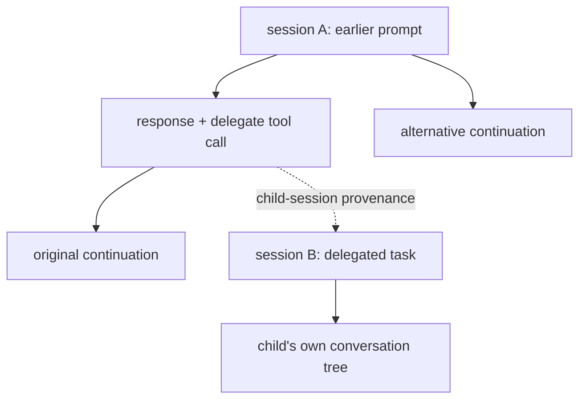

# pi in t3: interaction parity map

**the target is pi's tree, provenance, and control inside t3's workspace
experience—not another agent runtime or a port of every terminal widget.**

the user's correction sets the priorities: extensions already work but render
poorly; takeover does not make session ownership understandable; pi's tree,
branch exploration, and delegated-session provenance are the largest missing
part of the experience.

## evidence boundary

snapshot: 2026-09-29.

- nix/pi source: `dbd7dd9a3a715b72181d6a26a3a275a3caf3c081`.
- local t3 fork: `7bb723d5ee7181b1c0d3bebce8168a5d2f39e2c7`.
- deployed t3 revision recorded in `~/.local/share/t3-pi/dist/source-revision`:
  `911a5ee4811e1f5754c3e46f9faec212999689fd`.
- locally installed pi SDK: `@earendil-works/pi-coding-agent` **0.87.1**.

**VERIFIED** here means traced through source, not reproduced in the browser.
the inspected `piNative/`, native contracts, and `PiAdapter.ts` paths match
between the two t3 revisions; other server/client paths differ. t3 citations pin
the local revision. SDK citations address the installed version.

no user transcripts, live database, session takeover, browser interaction, model
request, or service change was used for this map. no extension/runtime parity
claim should be read as a completed acceptance test. implementation suggestions
are **HUNCH** until exercised on web and mobile.

## the three identities we must not collapse

| identity | what it controls | what it does not imply |
|---|---|---|
| **session + entry/leaf** | conversation ancestry and model context | current filesystem contents |
| **runtime/writer** | the pi process serving that session | exclusive control by one viewing client |
| **workspace/checkpoint** | source checkout and file restoration | pi conversation time travel |

pi entries use `id` and `parentId`. the active `leafId` selects a context path.
a separate fork/clone has its own session identity and a `parentSession` path.
delegated children are separate task sessions, not automatically copies of a
conversation branch. [session format][format] · [native branch behavior][sessions]



this is the desired navigable model, not today's t3 interface. switching a
context path does not undo shell commands, revert files, or replay tool calls.

## parity at a glance

all rows below are **VERIFIED-source**, with the limitations above.

| capability | native pi / our extensions | t3 today | classification |
|---|---|---|---|
| execute extension tools | custom tools execute and return content/details | translated tool events and extension-specific adaptations exist | **present; not a missing execution feature** [presentation] · [subagent] |
| render calls/results | native `renderCall` / `renderResult`, expansion, excerpts, framing | t3 owns its cards; terminal renderers do not cross RPC | **presentation adaptation gap** [native-render] · [presentation] · [web-cards] |
| inspect complete received tool data | renderer receives result content/details | selected text/details become `rawOutput`; image blocks are omitted from derived text, details are flattened, generic cards do not necessarily expose all of it | **data/presentation gap**, not proof raw source was deleted [presentation] · [web-output] |
| extension dialogs | select, confirm, input, editor in supported modes | spawned RPC handler immediately replies `cancelled: true` | **interaction gap**; not a claim that bridged TUI dialogs are canceled [rpc-ui] · [rpc-cancel] |
| terminal-only components | custom overlays/widgets/editor/header/footer | upstream RPC cannot carry arbitrary terminal components | **mode boundary**, not just a missing t3 card [rpc-ui] |
| read the conversation tree | entries, siblings, labels, summaries, current leaf; `get_tree`/`get_entries` RPC | raw entries can survive, but the consumed thread view is one flat ancestry path | **native data not promoted to navigation** [tree-rpc] · [projection] · [native-contract] |
| identify the live active branch | runtime returns authoritative `leafId` | external projection starts at the last tree-shaped appended entry; no authoritative live leaf is an input | **state gap** when navigation moves the live leaf without an append [tree-rpc] · [projection] · [leaf] |
| same-session time travel | `/tree` moves context without deleting sibling branches | no consumed entry-selection action in the native command path | **missing end-to-end control**, not solved by drawing a tree [sessions] · [native-contract] · [external-dispatch] |
| create a separate fork/clone | new session from ancestry; `parentSession` records relation | no native fork command exposed; root catalog excludes nonblank `parentSession` headers | **fork discovery/control gap** [tree-rpc] · [catalog] · [native-contract] |
| open a delegated child | custom tool returns child session/file/continue identity and owner attribution | agent task cards exist, but normalized metadata has no child-session destination; delegated sessions are excluded from root listing | **navigable provenance gap** [delegate] · [spawn] · [subagent] · [catalog] · [agents-panel] |
| continue a child at a specific leaf | session continuation works; our `piSpawn` explicitly rejects nonempty `leafId` | no branch-target continuation contract exposed | **existing pi-side limitation too**; do not promise terminal parity that is not wired [spawn] |
| tell what owns the running session | terminal process or RPC runtime | supervisor knows writer kind; projected external control labels flatten both into `live` | **visibility/model gap**, not absence of writer arbitration [native-contract] · [projection] · [writer-claim] |
| resume from another interface | existing runtime can accept steering/follow-up | guarded `resumeAndSend` reuses a registered writer or starts RPC; it does not stop unregistered writers elsewhere | **available, but not exclusive takeover** [acquisition] · [external-dispatch] |
| stop vs interrupt vs hand back | abort current work differs from shutting down pi | interrupt dispatches abort; stop dispatches shutdown; bridged shutdown calls `ctx.shutdown()`; no release/handoff command | **action-semantics gap** [external-dispatch] · [bridge] · [supervisor-protocol] |
| rewind workspace vs conversation | tree navigation and git restoration are different operations | t3 has rewind/checkpoints, but managed pi `rollbackThread` rejects; omitted capability can permit web rewind checks | **not tree parity; conditional unsupported-action risk** [adapter] · [rewind-check] · [rewind-contract] |

### counterexamples worth keeping

this is not “everything becomes JSON”:

- oracle/delegate-style details are interpreted as agent task/progress/usage
  metadata; web has dedicated agent rows. [subagent] · [web-cards]
- `@bds_pi/session-recap` is recognized and projected as a dedicated recap.
  [recap]
- raw native entry contracts retain arbitrary records, including ancestry fields.
  [native-contract]
- pi already exposes tree reads and separate-session fork/clone over RPC.
  t3 has not connected that capability to the relevant client model. [tree-rpc]
- web and mobile already warn that resuming on this host may create another
  writer if a terminal or another host is still running it. the issue is not
  total absence of explanation. [resume-web] · [resume-mobile]

**RPC tree reads are not same-session navigation.** `get_tree`/`get_entries`
inspect history; `fork`/`clone` create separate sessions. arbitrary `/tree`
navigation still needs an owner-directed SDK/extension control path. sending
the built-in `/tree` command through RPC `prompt` does not invoke the terminal
tree picker. [tree-rpc] · [rpc-command-limits]

## ownership: what “takeover” currently means

**it is guarded resume-and-send, not transfer of a session to a browser.**
registered-writer conflicts are protected within this supervisor, by canonical
session file; exclusive frontend-client ownership
and enforcement against unregistered writers are different claims.

| source situation | what actually happens | what the interface should make clear — HUNCH |
|---|---|---|
| registered terminal pi, idle | remote send targets that TUI; terminal remains usable | “terminal pi · connected · shared commands” |
| registered terminal pi, running | steer/follow-up and interrupt target that process | name the process and distinguish queued from delivered |
| supervisor-owned RPC | viewing client controls the hosted pi through the supervisor | “hosted pi”, not “this browser owns pi” |
| terminal bridge disconnects | reservation is retained temporarily, then may expire; disconnection does not terminate terminal pi | “connection unknown/reconnecting”, not proof of offline |
| no registered writer | confirmed resume reuses a writer found during acquisition, otherwise starts RPC | may resume locally; does not stop pi elsewhere |
| user chooses session stop | RPC is terminated, or bridged TUI receives shutdown | “stop hosted pi” / “stop terminal pi”, not “release control” |

sources: [registered writers][writer-claim], [disconnect behavior][disconnect],
[acquisition][acquisition], [external dispatch][external-dispatch],
[bridge shutdown][bridge], [native RPC shutdown][rpc-stop].

the current web confirmation says “start a new Pi writer”, although acquisition
can reuse one; mobile also uses “Confirm takeover”. both obscure the distinction
between runtime identity and client control. [resume-web] · [resume-mobile] · [mobile-queue] · [acquisition]

recommended independent indicators:

```text
runtime: terminal pi | hosted pi | no registered runtime
connection: connected | reconnecting | unknown
activity: idle | running | queued
target: session identity + authoritative active leaf, or leaf unknown
receipt: admitted | rejected | delivery indeterminate
```

admission is not completion. command IDs/receipts prevent some duplicate
admissions, not arbitrary repeated tool effects. uncertain delivery must remain
visible rather than trigger a silent resend. [receipts] · [admission]

## where to spend effort next

**HUNCH: one coherent “native pi in t3” project, with tree/provenance as its
center and explicit ownership as its correctness boundary.**

1. **promote pi's model, don't reconstruct it from flat messages.**
   expose authoritative tree reads, live leaf updates, labels, branch summaries,
   and selectable entry identity. keep historical browsing separate from changing
   the active context. allow child lookup from a known parent without dumping all
   delegated tasks into the root sidebar.
2. **make ownership and branch mutation explicit.**
   show which runtime will act; revalidate the target before applying a branch
   change. invoke the owning pi runtime's native navigation semantics, including
   hooks/context rebuilding, rather than editing JSONL from the browser.
   unknown ownership or a stale leaf should produce a decision, not a guessed
   second writer. absence of a registered writer is not global absence of one.
3. **connect provenance, not merely agent status.**
   preserve child session identity and originating tool-call location. resolve
   the originating entry when supported by evidence; show unknown when it is not.
   opening a child should make the exact parent location reachable again.
4. **improve received-result inspection and supported interactions.**
   retain lossless received content/details, then adapt bash/agent cards.
   expose RPC-capable dialogs instead of auto-canceling them. treat terminal-only
   components as explicitly unsupported or provide a separately designed TUI
   attachment—not an assumed zero-cost browser conversion.

these are integration boundaries, not an implementation prescription for a new
framework. scheduling should later target the same explicit session/workspace
model. do not add scheduling to ambiguous writer and branch targeting first.

## acceptance cases, not claimed results

run on **web and mobile**, with synthetic sessions and owned processes:

1. browse sibling branches, labels, branch summaries, and pre-compaction history
   without changing context, spawning a writer, or executing a tool.
2. show the authoritative active leaf; a terminal `/tree` move with no new
   message updates it. unavailable live state is labeled unknown.
3. select an earlier user message, edit it, continue into a sibling branch, and
   return to the original path under the same session identity.
4. distinguish same-session navigation from a separate fork/clone. new sessions
   retain a visible parent link and remain reachable despite root-list filtering.
5. open a delegated child from its originating call and return to that parent
   location. repeated child continuation is not shown as a newly created child.
6. selected-leaf child continuation either works explicitly or reports unsupported;
   it never silently resumes some other leaf.
7. use phone and terminal together: connected remote send targets the registered
   writer; confirmation races reuse it; no UI promises exclusive client control.
8. distinguish interrupt, stop terminal pi, stop hosted pi, and any future handoff.
   disconnects and indeterminate receipts do not silently imply safe retries.
9. inspect bash's command/output and an oracle result in full, including the
   received structured details; expansion does not just repeat the task title.
10. answer/cancel a supported pi extension dialog. terminal-only UI has an honest
    fallback instead of silent apparent parity.
11. conversation navigation leaves workspace files unchanged. checkpoint restore
    is a separate explicit action; unsupported pi rollback cannot masquerade as
    successful time travel.

## falsification and remaining questions

- checked both raw-entry preservation and consumed contracts/actions: tree data
  surviving somewhere does not refute missing client navigation.
- checked native RPC tree/fork commands, dedicated subagent/recap handling, and
  resume warnings as counterexamples to blanket missing-feature claims.
- checked registered-writer arbitration and runtime reuse: this map does not
  claim zero ownership protection or a guaranteed new process on resume.
- checked live leaf movement against persisted reload semantics: last-entry
  inference can match reopened files; it is not always wrong.
- checked our actual `leafId` routing rejection: session continuation alone is
  not selected-branch continuation.

**QUESTION:** which Pi binary/bridge version is the deployed supervisor actually
using, and do all the interfaces expose these source paths at runtime? browser
rendering, real device interactions, conflicting unregistered writers, restart
behavior, and the acceptance cases above were not runtime-tested. do not resolve
those questions by experimenting on the user's live sessions.

## source references

fork permalinks below pin inspected code. installed SDK references require the
normal `modules/pi` dependency installation; they are not bundled with this map.

[format]: ../pi/node_modules/@earendil-works/pi-coding-agent/docs/session-format.md#L49-L76
[sessions]: ../pi/node_modules/@earendil-works/pi-coding-agent/docs/sessions.md#L20-L38
[tree-rpc]: ../pi/node_modules/@earendil-works/pi-coding-agent/docs/rpc-commands.md#L604-L739
[rpc-command-limits]: ../pi/node_modules/@earendil-works/pi-coding-agent/docs/rpc-commands.md#L780-L828
[leaf]: ../pi/node_modules/@earendil-works/pi-coding-agent/dist/core/session-manager.js#L1151-L1194
[native-render]: ../pi/node_modules/@earendil-works/pi-coding-agent/dist/modes/interactive/components/tool-execution.js#L244-L275
[rpc-ui]: ../pi/node_modules/@earendil-works/pi-coding-agent/docs/rpc-extension-ui.md#L5-L25
[delegate]: https://github.com/bdsqqq/dots/blob/dbd7dd9a3a715b72181d6a26a3a275a3caf3c081/modules/pi/packages/extensions/delegate/index.ts#L178-L251
[spawn]: https://github.com/bdsqqq/dots/blob/dbd7dd9a3a715b72181d6a26a3a275a3caf3c081/modules/pi/packages/core/pi-spawn/index.ts#L447-L564
[bridge]: https://github.com/bdsqqq/dots/blob/dbd7dd9a3a715b72181d6a26a3a275a3caf3c081/modules/pi/packages/extensions/t3-control-v2.ts#L197-L223
[projection]: https://github.com/bdsqqq/t3code/blob/7bb723d5ee7181b1c0d3bebce8168a5d2f39e2c7/apps/server/src/piNative/PiSessionProjection.ts#L85-L184
[presentation]: https://github.com/bdsqqq/t3code/blob/7bb723d5ee7181b1c0d3bebce8168a5d2f39e2c7/apps/server/src/piNative/PiSessionProjection.ts#L52-L262
[recap]: https://github.com/bdsqqq/t3code/blob/7bb723d5ee7181b1c0d3bebce8168a5d2f39e2c7/apps/server/src/piNative/PiSessionProjection.ts#L334-L387
[native-contract]: https://github.com/bdsqqq/t3code/blob/7bb723d5ee7181b1c0d3bebce8168a5d2f39e2c7/packages/contracts/src/piNative.ts#L13-L133
[catalog]: https://github.com/bdsqqq/t3code/blob/7bb723d5ee7181b1c0d3bebce8168a5d2f39e2c7/apps/server/src/piNative/SessionCatalog.ts#L185-L232
[subagent]: https://github.com/bdsqqq/t3code/blob/7bb723d5ee7181b1c0d3bebce8168a5d2f39e2c7/apps/server/src/provider/pi/PiSubagent.ts#L98-L157
[agents-panel]: https://github.com/bdsqqq/t3code/blob/7bb723d5ee7181b1c0d3bebce8168a5d2f39e2c7/apps/web/src/components/AgentsPanel.tsx#L139-L163
[web-cards]: https://github.com/bdsqqq/t3code/blob/7bb723d5ee7181b1c0d3bebce8168a5d2f39e2c7/apps/web/src/components/chat/MessagesTimeline.tsx#L4399-L4561
[web-output]: https://github.com/bdsqqq/t3code/blob/7bb723d5ee7181b1c0d3bebce8168a5d2f39e2c7/apps/web/src/session-logic.ts#L1251-L1279
[resume-web]: https://github.com/bdsqqq/t3code/blob/7bb723d5ee7181b1c0d3bebce8168a5d2f39e2c7/apps/web/src/components/ChatView.logic.ts#L880-L897
[resume-mobile]: https://github.com/bdsqqq/t3code/blob/7bb723d5ee7181b1c0d3bebce8168a5d2f39e2c7/apps/mobile/src/state/use-thread-composer-state.ts#L85-L96
[mobile-queue]: https://github.com/bdsqqq/t3code/blob/7bb723d5ee7181b1c0d3bebce8168a5d2f39e2c7/apps/mobile/src/features/threads/ThreadComposer.tsx#L1053-L1056
[writer-claim]: https://github.com/bdsqqq/t3code/blob/7bb723d5ee7181b1c0d3bebce8168a5d2f39e2c7/apps/server/src/piNative/SupervisorDaemon.ts#L960-L984
[disconnect]: https://github.com/bdsqqq/t3code/blob/7bb723d5ee7181b1c0d3bebce8168a5d2f39e2c7/apps/server/src/piNative/SupervisorDaemon.ts#L1978-L2068
[acquisition]: https://github.com/bdsqqq/t3code/blob/7bb723d5ee7181b1c0d3bebce8168a5d2f39e2c7/apps/server/src/piNative/SupervisorDaemon.ts#L1307-L1329
[external-dispatch]: https://github.com/bdsqqq/t3code/blob/7bb723d5ee7181b1c0d3bebce8168a5d2f39e2c7/apps/server/src/piNative/PiExternalThreadSource.ts#L1239-L1316
[rpc-cancel]: https://github.com/bdsqqq/t3code/blob/7bb723d5ee7181b1c0d3bebce8168a5d2f39e2c7/apps/server/src/piNative/SupervisorDaemon.ts#L1196-L1211
[rpc-stop]: https://github.com/bdsqqq/t3code/blob/7bb723d5ee7181b1c0d3bebce8168a5d2f39e2c7/apps/server/src/piNative/SupervisorDaemon.ts#L1484-L1495
[supervisor-protocol]: https://github.com/bdsqqq/t3code/blob/7bb723d5ee7181b1c0d3bebce8168a5d2f39e2c7/apps/server/src/piNative/SupervisorProtocol.ts#L96-L140
[receipts]: https://github.com/bdsqqq/t3code/blob/7bb723d5ee7181b1c0d3bebce8168a5d2f39e2c7/apps/server/src/piNative/SupervisorDaemon.ts#L1614-L1633
[admission]: https://github.com/bdsqqq/t3code/blob/7bb723d5ee7181b1c0d3bebce8168a5d2f39e2c7/apps/server/src/piNative/SupervisorDaemon.ts#L1827-L1916
[adapter]: https://github.com/bdsqqq/t3code/blob/7bb723d5ee7181b1c0d3bebce8168a5d2f39e2c7/apps/server/src/provider/Layers/PiAdapter.ts#L1257-L1276
[rewind-check]: https://github.com/bdsqqq/t3code/blob/7bb723d5ee7181b1c0d3bebce8168a5d2f39e2c7/apps/web/src/components/ChatView.tsx#L2922-L2928
[rewind-contract]: https://github.com/bdsqqq/t3code/blob/7bb723d5ee7181b1c0d3bebce8168a5d2f39e2c7/packages/contracts/src/orchestration.ts#L1466-L1479
