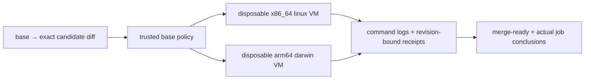

# merge-candidate verification

this gate turns [the repository verification policy](../../AGENTS.md) into a
versioned check plan. unknown consumers block rather than silently receiving
syntax-only coverage.



## authority and isolation

`.github/workflows/verify.yml` runs for every PR, merge group, main push, and
manual dispatch, without path filters. workers use GitHub-hosted VMs—not
production machines, personal homes, deployment credentials, or production Nix
daemons. a root-owned controller creates a dedicated, non-admin candidate
account; child commands run as that account, with no supplementary process
groups beyond its primary gid.
trusted verifier files and evidence are not candidate-writable. a private Git
snapshot—not the candidate's writable `.git` or home configuration—owns the
post-run tracked-file audit.

before candidate execution, the controller checks effective uid/groups, denied
passwordless sudo, denied writes to verifier/evidence/metadata, and Nix trust
configuration. the daemon check assumes the installer's fresh daemon uses that
protected system configuration; it does not inspect a live daemon's internal
settings. native provisioning and these cross-uid checks still need hosted
execution before enabling branch enforcement.

Darwin's `id -G` includes directory-service defaults, not just inherited process
groups. a Node syscall probe checks the actual process credentials; directory
memberships are checked separately against daemon trust and writable toolchain
ancestors. additional directory memberships are not an exception to the process
identity guard.

commands receive an allowlisted environment and a temporary home. these
measures are not a complete security sandbox; the disposable VM is the boundary
around all candidate execution. `isolate.ts` provisions accounts only when
explicitly invoked as root with GitHub CI markers. do not run it on a personal
or production machine.

runner labels follow GitHub's [hosted-runner reference](https://docs.github.com/en/actions/reference/runners/github-hosted-runners);
the controller also rejects an architecture mismatch at runtime.

planning, runner, gate, and resource probes execute from the base checkout.
candidate code executes only as the software under test. resource probes read
the candidate through `--root`; changing a candidate validator cannot replace
the trusted validator. receipts bind the full base/candidate revisions, trusted
policy digest, plan digest, platform, phase, logical command, exit status, and
log. logs also record the actual executed arguments.

both native jobs must conclude successfully, even when one has no selected
checks. missing, cancelled, timed-out, duplicate, stale, or failed evidence
cannot pass. commands have process-group deadlines and noninteractive stdin.
tracked-checkout drift fails verification. no activation, credential decryption,
model requests, infrastructure reconciliation, or deployments are planned.

## selection and coverage

`policy.ts` unions changed consumers, retaining deleted/renamed paths against
the base graph. its literal Nix graph and explicit host factories/output mappings
are deliberately not a general Nix evaluator. unsupported dynamic consumption,
unmapped outputs, and runtime sources without a bounded behavior check block.

- ordinary Pi TypeScript: frozen install, typecheck, inline tests.
- production Pi inputs: build, manifest/export parity, source/built codemode
  probes, and built prompt-tool tests.
- configuration, extension manifests, prompts, and themes: actual SDK reloads
  in temporary state. guidance, skills, entrypoints, and selected themes must
  really load; registration/reload is not tool or model acceptance.
- Nix inputs: consuming native host evaluation with forced `.drvPath`, plus
  consuming package/home artifacts or full host closures where required.
- `zmx-rows`: its actual selected wrapper, not merely `pkgs.zmx`.
- global tool updates: both frozen workspaces and Pi/Codex/T3 version authority.
  this does not certify every npm tool or a live T3 server; these updates require
  manual merge review.
- Markdown: bounded repository-local links; archival capture exclusions are
  explicit. no network crawling.

new consumers require a traced mapping and negative coverage tests.
verification-policy/workflow/guidance changes and dependency-age policy changes
are not automatic-merge eligible. this flag is evidence for a future promotion
controller, not an installed auto-merge mechanism.

## local checks

from the repository root:

```sh
node --test scripts/ci/*.test.ts
nix run --no-write-lock-file --inputs-from . nixpkgs#actionlint -- .github/workflows/verify.yml
node scripts/ci/probes.ts pi
node scripts/ci/probes.ts tools
```

the selector's strict TypeScript command uses the frozen Pi workspace's
installed TypeScript and Node types. runner integration tests use temporary
repositories and bounded subprocesses; they do not activate a real home.

to inspect a clean committed candidate without executing its checks:

```sh
node scripts/ci/plan.ts --root "$PWD" --base BASE_SHA --head CANDIDATE_SHA \
  --policy-root /path/to/trusted/base/checkout --output /tmp/verification-plan.json
```

the normal workflow needs a base containing this policy. for the initial
installation, the repository owner can manually dispatch with `bootstrap: true`
and an explicit full `base` SHA after reviewing the candidate. this selects
candidate policy for that one run; it does not authorize automatic merging.

## enabling the merge boundary

adding a workflow does **not** protect a branch. after publishing and exercising
the workflow, configure repository rules separately:

1. require `merge-ready`, a current candidate, and no bypass for update/repair
   identities.
2. require owner review for `.github/**`, `scripts/ci/**`, verification guidance,
   and dependency-age policy (`.github/CODEOWNERS` supplies these owners).
   a candidate PR workflow can otherwise replace the
   job itself; base-policy execution alone cannot prevent that.
3. validate the exact required check context and bootstrap, fork-PR, merge-group,
   failed-command, unavailable-worker, and stale-evidence behavior on GitHub.
4. only then enable eligible auto-merge/promotion. bots, pull deployment,
   backups, idle detection, and health/recovery are separate work.

checks do not prove visual quality, prompt quality, Homebrew activation,
credential login, state migration, or productivity. report those gaps rather
than treating a successful build as runtime acceptance.
