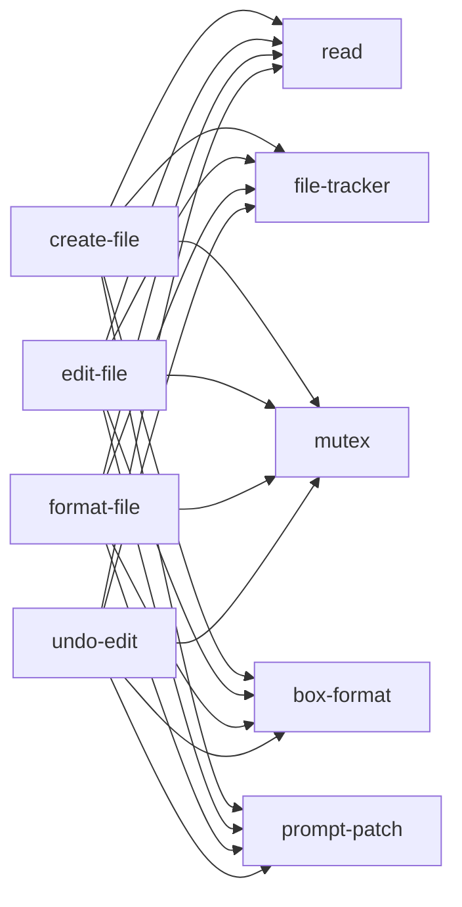
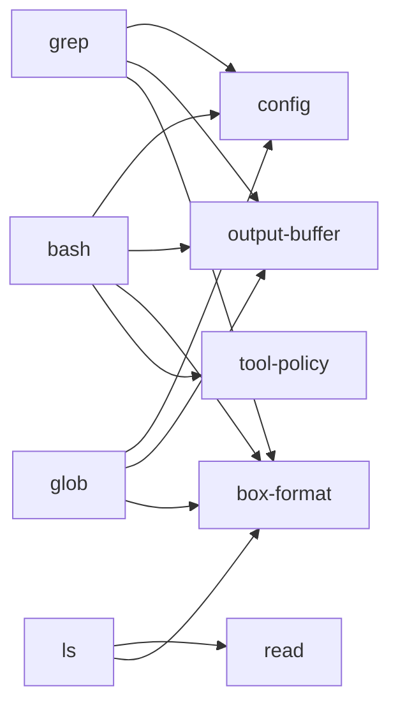
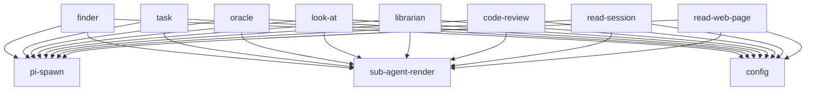

# capability package spec

this is the repo-wide package spec for `user/pi`.

it replaces the earlier narrow spec that mostly covered mentions, handoff, and editor.

## lede

pi is still the outer platform.

- pi extensions are the top-level runtime units
- pi packages are the top-level install/distribution units
- `user/pi` defines an internal architecture across its core packages and extensions

this doc covers the **full package set** we currently have:

- all core packages under `packages/core/*`
- all extension packages under `packages/extensions/*`
- including `packages/extensions/e2e` as a test/support package, even though it is not a runtime extension entrypoint

---

## package role taxonomy

these labels are for this repo, not pi itself.

| role                | meaning                                                              |
| ------------------- | -------------------------------------------------------------------- |
| `helper`            | low-level utility with no user-facing surface                        |
| `runtime-helper`    | shared runtime plumbing used by multiple features/extensions         |
| `domain-runtime`    | reusable runtime logic for a user-facing domain                      |
| `host-extension`    | extension that hosts other behavior or ui composition                |
| `adapter-extension` | extension that bridges shared runtime into pi lifecycle/ui/tool apis |
| `feature-extension` | extension that owns a user-facing behavior/workflow                  |
| `tool-extension`    | extension whose primary job is registering one or more tools         |
| `test/support`      | non-runtime package for fixtures/tests                               |

---

## full package inventory

## core packages

| package               | role           | purpose                                                                                            | main composition                                                |
| --------------------- | -------------- | -------------------------------------------------------------------------------------------------- | --------------------------------------------------------------- |
| `agents-md`           | helper         | discover + format `AGENTS.md` guidance for a file path                                             | currently no direct in-tree consumers found                     |
| `box-chrome`          | helper         | box-drawing layout primitives                                                                      | `box-format`, `editor`, `command-palette`                       |
| `box-format`          | runtime-helper | standard boxed rendering for tool results and structured text                                      | many tool extensions                                            |
| `config`              | runtime-helper | namespaced config merge/cache for our package                                                      | many extensions, `interpolate`                                  |
| `editor-capabilities` | runtime-helper | typed editor autocomplete contributor contracts + package-local registry                           | `editor`, `mentions`                                            |
| `file-tracker`        | runtime-helper | persist before/after file changes for undo                                                         | `create-file`, `edit-file`, `format-file`, `undo-edit`          |
| `fs`                  | runtime-helper | shared path normalization, tolerant resolution, directory listing, and tiny recursive walk helpers | `read`, `ls`, file tools, session indexing                      |
| `github-api`          | domain-runtime | shared `gh api` helpers and repo parsing                                                           | `github`                                                        |
| `html-to-md`          | domain-runtime | html → llm-friendly markdown conversion                                                            | `read-web-page`                                                 |
| `interpolate`         | runtime-helper | prompt variable interpolation/runtime vars                                                         | `pi-spawn`, `system-prompt`                                     |
| `mentions`            | domain-runtime | mention parsing, indexing, resolution, render, autocomplete provider                               | `mentions` extension, `search-sessions` shared session parsing  |
| `mutex`               | helper         | per-path async file lock                                                                           | file-mutating tools, `bash`                                     |
| `output-buffer`       | helper         | bounded head/tail truncation utilities                                                             | `bash`, `read`, `grep`, `glob`, `read-session`, `read-web-page` |
| `tool-policy`         | runtime-helper | tool policy rules for tool routing; guardrails, not a hard security boundary                       | `bash`, file-aware tools                                         |
| `pi-spawn`            | runtime-helper | nested pi/sub-agent orchestration                                                                  | sub-agent tool family, prompt helpers                           |
| `prompt-patch`        | helper         | derive prompt snippet/guidelines from tool descriptions                                            | most tool extensions                                            |
| `show`                | helper         | excerpt/windowing primitives                                                                       | `box-format`, `show-renderer`                                   |
| `show-renderer`       | helper         | cached renderer wrapper over `show()`                                                              | currently no direct extension consumers found                   |
| `sub-agent-render`    | runtime-helper | normalize + render spawned-agent results                                                           | sub-agent tool family                                           |
| `tool-cost`           | helper         | shared `details.cost` contract/type guard                                                          | `editor`, `web-search`, `sub-agent-render`                      |
| `tui`                 | helper         | lazy `pi-tui` re-exports for safe runtime/test imports                                             | `bash`                                                          |

## extension packages

| package           | role              | primary registration surface            | purpose                                                                                   |
| ----------------- | ----------------- | --------------------------------------- | ----------------------------------------------------------------------------------------- |
| `bash`            | tool-extension    | tool                                    | custom `bash` tool                                                                        |
| `code-review`     | tool-extension    | tool                                    | spawned review agent over diffs                                                           |
| `command-palette` | feature-extension | command + shortcut + overlay ui         | searchable palette for tools/models/commands                                              |
| `create-file`     | tool-extension    | tool                                    | custom `write` tool                                                                       |
| `e2e`             | test/support      | none                                    | e2e fixtures/support, not runtime                                                         |
| `edit-file`       | tool-extension    | tool                                    | custom `edit` tool                                                                        |
| `editor`          | host-extension    | editor/footer/widget host               | boxed editor + status/label/ui hosting                                                    |
| `finder`          | tool-extension    | tool                                    | concept-level codebase search via sub-agent                                               |
| `format-file`     | tool-extension    | tool                                    | formatter runner with undo tracking                                                       |
| `github`          | tool-extension    | tools                                   | GitHub repo exploration/search/history tools                                              |
| `glob`            | tool-extension    | tool                                    | custom `find`/glob file matcher                                                           |
| `grep`            | tool-extension    | tool                                    | custom `grep` tool                                                                        |
| `handoff`         | feature-extension | command + tool + lifecycle interception | session handoff workflow                                                                  |
| `librarian`       | tool-extension    | tool                                    | cross-repo codebase understanding                                                         |
| `look-at`         | tool-extension    | tool                                    | interpreted file/image analysis                                                           |
| `ls`              | tool-extension    | tool                                    | compatibility directory listing                                                           |
| `mentions`        | adapter-extension | lifecycle hooks                         | mention resolution + hidden context injection + optional editor autocomplete registration |
| `mermaid`         | feature-extension | renderer + command + shortcut + hooks   | inline/full mermaid rendering                                                             |
| `oracle`          | tool-extension    | tool                                    | advisory deep reasoning via sub-agent                                                     |
| `read`            | tool-extension    | tool                                    | custom `read` tool                                                                        |
| `read-session`    | tool-extension    | tool                                    | extract relevant info from past sessions                                                  |
| `read-web-page`   | tool-extension    | tool                                    | fetch/convert web pages, optional QA                                                      |
| `search-sessions` | feature-extension | tool                                    | branch-level session search                                                               |
| `session-name`    | feature-extension | lifecycle hooks                         | automatic session naming                                                                  |
| `skill`           | tool-extension    | tool                                    | load skills by name                                                                       |
| `system-prompt`   | adapter-extension | lifecycle hook                          | append package-managed system prompt                                                      |
| `task`            | tool-extension    | tool                                    | delegate a subtask to another agent                                                       |
| `tool-harness`    | adapter-extension | lifecycle hooks                         | env-driven active-tool filtering                                                          |
| `undo-edit`       | tool-extension    | tool                                    | revert tracked file changes                                                               |
| `web-search`      | tool-extension    | tool                                    | web search via external api                                                               |

---

## core package specs

## `packages/core/agents-md`

- **role:** helper
- **does:** discovers relevant `AGENTS.md` files from workspace root to target path and formats them into guidance blocks.
- **exports:** `discoverAgentsMd()`, `formatGuidance()`, `AgentsGuidance`
- **composes with:** intended for file-aware tools; no direct in-tree consumer found yet.
- **note:** this looks staged for future composition rather than currently central.

## `packages/core/box-chrome`

- **role:** helper
- **does:** string-level box border/chrome layout with caller-provided styling.
- **exports:** `boxTop()`, `boxRow()`, `boxBorderLR()`, `boxBottom()` and layout types.
- **composes with:** `box-format`, `editor`, `command-palette`.

## `packages/core/box-format`

- **role:** runtime-helper
- **does:** boxed/excerpted rendering for tool outputs and structured sections, with width safety for pi tui.
- **exports:** `boxRendererWindowed()`, `formatBoxesWindowed()`, `textSection()`, `osc8Link()`, `renderCallLine()` and section/block types.
- **composes with:** nearly every tool extension that renders structured results.

## `packages/core/config`

- **role:** runtime-helper
- **does:** merged namespaced config resolution with defaults, global file, optional project-local override, plus caching.
- **exports:** `getExtensionConfig()`, `getGlobalConfig()`, `resolveConfigDir()`, cache helpers.
- **composes with:** most extensions and `core/interpolate`.
- **target direction:** grow schema/gating helpers for our package-local capabilities; do not compete with pi package/resource settings.

## `packages/core/editor-capabilities`

- **role:** runtime-helper
- **does:** define typed editor autocomplete contributor contracts, keep the package-local contributor registry, and compose contributors over pi's base provider.
- **exports:** `EditorAutocompleteContributor`, `registerEditorAutocompleteContributor()`, `subscribeEditorAutocompleteContributors()`, `composeEditorAutocompleteProvider()`.
- **composes with:** `extensions/editor`, `extensions/mentions`.
- **read:** shared host/runtime seam for editor autocomplete; not a second extension system.

## `packages/core/file-tracker`

- **role:** runtime-helper
- **does:** persist before/after content and diffs for file changes, keyed by session + tool call ids.
- **exports:** `saveChange()`, `loadChanges()`, `revertChange()`, `findLatestChange()`, `simpleDiff()`.
- **composes with:** `create-file`, `edit-file`, `format-file`, `undo-edit`.

## `packages/core/fs`

- **role:** runtime-helper
- **does:** centralize the file-path and directory semantics that had drifted into `extensions/read`: `@`/`~` expansion, cwd-relative resolution, mac-tolerant path fallback, shared directory listing text, and a tiny recursive walker for local package internals.
- **exports:** `expandPath()`, `resolveToAbsolute()`, `resolveWithVariants()`, `isSecretFile()`, `listDirectory()`, `walkDirSync()`.
- **composes with:** `read`, `ls`, `bash`, file-mutating tools, `core/mentions/session-index`, `read-session`.
- **read:** keep this seam boring. it owns file-aware helper semantics, not read-tool rendering or rich file content handling.

## `packages/core/github-api`

- **role:** domain-runtime
- **does:** shared GitHub cli/http helpers: repo parsing, pagination, contents decoding, line numbering, truncation.
- **exports:** `parseRepoUrl()`, `ghApi()`, `ghApiPaginated()`, `decodeBase64Content()`, `addLineNumbers()`, `truncate()`.
- **composes with:** `extensions/github`.

## `packages/core/html-to-md`

- **role:** domain-runtime
- **does:** convert fetched html into llm-oriented markdown, stripping page chrome and focusing main content.
- **exports:** `isHtml()`, `htmlToMarkdown()`.
- **composes with:** `extensions/read-web-page`.

## `packages/core/interpolate`

- **role:** runtime-helper
- **does:** resolve prompt variables from runtime/env/files/js/sh; compute cwd/git/session vars; interpolate prompt templates.
- **exports:** `DEFAULT_PROMPT_VARIABLES`, `computeRuntimeVars()`, `interpolatePromptVars()`, git helpers.
- **composes with:** `pi-spawn`, `system-prompt`.

## `packages/core/mentions`

- **role:** domain-runtime
- **does today:**
  - parse `@commit/...`, `@session/...`, `@handoff/...`
  - detect autocomplete prefixes
  - keep the mention source registry and built-in `commit` source
  - index git commits and pi sessions
  - resolve mentions through registered sources
  - render hidden mention context
  - expose `MentionAwareProvider` as the mention-specific autocomplete wrapper used by the mentions adapter
  - share session indexing with `core/fs` directory walking rather than custom recursion
- **exports:** parser, renderers, caches, commit/session indexes, resolver, source registry, provider.
- **composes with:**
  - `extensions/mentions` as lifecycle + autocomplete adapter
  - `extensions/search-sessions` as `session` source owner
  - `extensions/handoff` as `handoff` source owner
- **target direction:** stay the contract + registry + source-helper layer for addressable references, without pretending to be a pi-wide plugin system.

## `packages/core/mutex`

- **role:** helper
- **does:** per-path async locking so concurrent writes/execs do not trample each other.
- **exports:** `withFileLock()`.
- **composes with:** file tools and `bash`.

## `packages/core/output-buffer`

- **role:** helper
- **does:** bounded output truncation: head/tail buffers, char-based head/tail, rolling streaming buffer.
- **exports:** `headTail()`, `formatHeadTail()`, `headTailChars()`, `OutputBuffer`.
- **composes with:** output-heavy tools.

## `packages/core/tool-policy`

- **role:** runtime-helper
- **does:** evaluate tool policy rules from config files. these are guardrails for tool routing, not a hard security boundary.
- **exports:** `evaluateToolPolicy()`, `loadToolPolicy()` and related types.
- **composes with:** `bash` and file-aware tools.

## `packages/core/pi-spawn`

- **role:** runtime-helper
- **does:** spawn nested pi runs in json/rpc modes, select models, scope tools, interpolate prompts, collect usage.
- **exports:** `piSpawn()`, `readAgentPrompt()`, `resolvePrompt()`, usage/result/config types.
- **composes with:** spawned-agent tool family (`finder`, `task`, `oracle`, `look-at`, `librarian`, `code-review`, `read-session`, `read-web-page`) and prompt-loading helpers.

## `packages/core/prompt-patch`

- **role:** helper
- **does:** derive `promptSnippet` and `promptGuidelines` from tool descriptions.
- **exports:** `withPromptPatch()`.
- **composes with:** most tool extensions.

## `packages/core/show`

- **role:** helper
- **does:** visual excerpt/windowing over arrays/text for compact renders.
- **exports:** `windowItems()`, `show()` and related types.
- **composes with:** `box-format`, `show-renderer`.

## `packages/core/show-renderer`

- **role:** helper
- **does:** cached renderer wrapper over `show()` matching pi tui component expectations.
- **exports:** `makeShowRenderer()`, `ShowRenderer`.
- **composes with:** `show`; no direct extension consumer found currently.

## `packages/core/sub-agent-render`

- **role:** runtime-helper
- **does:** normalize spawned-agent output into tool results, add cost data, and render a collapsible tree view.
- **exports:** `subAgentResult()`, `renderAgentTree()`, usage formatting helpers, display-item extraction.
- **composes with:** sub-agent tool family.

## `packages/core/tool-cost`

- **role:** helper
- **does:** standard `details.cost` contract and type guard.
- **exports:** `ToolCostDetails`, `hasToolCost()`.
- **composes with:** `editor`, `web-search`, `sub-agent-render`.

## `packages/core/tui`

- **role:** helper
- **does:** lazy wrappers for `Text`, `Container`, `Markdown` to avoid eager `pi-tui` loading in some contexts/tests.
- **exports:** `getText()`, `getContainer()`, `getMarkdown()`.
- **composes with:** `bash`.

---

## extension package specs

## `packages/extensions/bash`

- **role:** tool-extension
- **registers:** tool `bash`
- **does:** custom shell execution with command cleanup, tool policy checks, git commit trailer injection, lock coordination, graceful process shutdown, structured output truncation.
- **main composition:** `box-format`, `config`, `fs`, `mutex`, `output-buffer`, `tool-policy`, `prompt-patch`, `tui`.
- **read:** custom-heavy replacement, not a thin wrapper around pi built-in bash.

## `packages/extensions/code-review`

- **role:** tool-extension
- **registers:** tool `code_review`
- **does:** spawn a review-oriented sub-agent, then parse XML review comments into severity-aware results.
- **main composition:** `pi-spawn`, `prompt-patch`, `sub-agent-render`, `config`, plus local tool suite `bash`, `glob`, `grep`, `ls`, `read`, `read-web-page`, `web-search`.
- **read:** model adapter with local XML post-processing.

## `packages/extensions/command-palette`

- **role:** feature-extension
- **registers:** shortcut `ctrl+p`, command `/palette`, custom overlay ui
- **does:** searchable palette for model changes, thinking levels, tool activation, commands, and delegated built-in flows.
- **main composition:** local palette/adapters modules, `box-chrome`, pi command/model/tool apis.
- **read:** self-contained feature ui.

## `packages/extensions/create-file`

- **role:** tool-extension
- **registers:** tool `write`
- **does:** create/overwrite files, auto-create parent dirs, track mutations for undo.
- **main composition:** `box-format`, `file-tracker`, `fs`, `mutex`, `prompt-patch`.
- **read:** adapter-heavy local tool.

## `packages/extensions/e2e`

- **role:** test/support
- **registers:** none
- **does:** fixture/support package for e2e cases.
- **main composition:** not part of runtime extension graph.

## `packages/extensions/edit-file`

- **role:** tool-extension
- **registers:** tool `edit`
- **does:** tracked file edits with exact/fuzzy matching, multi-edit `edits[]`, newline preservation, diff output, undo support.
- **main composition:** `box-format`, `file-tracker`, `fs`, `mutex`, `prompt-patch`.
- **read:** custom-heavy local tool.

## `packages/extensions/editor`

- **role:** host-extension
- **registers:** editor replacement, footer replacement, below-editor widget, event-bus listeners
- **does:** boxed editor chrome, top/bottom labels, status row, activity spinner, cwd/branch/model/cost display, and autocomplete contributor hosting over pi's base provider.
- **main composition:** `box-chrome`, `tool-cost`, `editor-capabilities`, local `widget-row.ts`.
- **read:** primary ui host in this repo.
- **note:** mention semantics now arrive through `editor-capabilities` contributors instead of a direct `core/mentions` import.

## `packages/extensions/finder`

- **role:** tool-extension
- **registers:** tool `finder`
- **does:** concept-level codebase search via spawned sub-agent.
- **main composition:** `pi-spawn`, `prompt-patch`, `sub-agent-render`, `config`, local tool suite `glob`, `grep`, `ls`, `read`.
- **read:** model adapter.

## `packages/extensions/format-file`

- **role:** tool-extension
- **registers:** tool `format_file`
- **does:** run prettier/biome, report formatting results, track before/after for undo.
- **main composition:** `box-format`, `config`, `file-tracker`, `fs`, `mutex`, `prompt-patch`.
- **read:** adapter-heavy local tool.

## `packages/extensions/github`

- **role:** tool-extension
- **registers:** `read_github`, `search_github`, `list_directory_github`, `list_repositories`, `glob_github`, `commit_search`, `diff`
- **does:** GitHub remote repo browsing/search/history/diff via `gh api`.
- **main composition:** `box-format`, `github-api`, `prompt-patch`.
- **read:** custom domain tool suite.

## `packages/extensions/glob`

- **role:** tool-extension
- **registers:** tool `find`
- **does:** ripgrep-backed file glob search with mtime sort and pagination.
- **main composition:** `box-format`, `config`, `output-buffer`, `prompt-patch`.
- **read:** adapter-heavy local tool.

## `packages/extensions/grep`

- **role:** tool-extension
- **registers:** tool `grep`
- **does:** ripgrep-backed content search with caps, truncation, context lines, structured render.
- **main composition:** `box-format`, `config`, `output-buffer`, `prompt-patch`.
- **read:** adapter-heavy local tool.

## `packages/extensions/handoff`

- **role:** feature-extension
- **registers:** command `/handoff`, tool `handoff`, lifecycle interception around compaction/session switching
- **does:** replace compaction with an explicit handoff workflow: prompt extraction, prompt review/editing, child session creation, provenance display, and registration of the `handoff` mention source.
- **main composition:** `config`, `mentions`, `pi-spawn`, pi event bus to coordinate with editor labels/widgets.
- **read:** workflow feature.
- **note:** remains self-sufficient even if mentions/editor affordances are absent; the extra mention capability is optional.

## `packages/extensions/librarian`

- **role:** tool-extension
- **registers:** tool `librarian`
- **does:** cross-repo codebase understanding via spawned sub-agent using the GitHub tool suite.
- **main composition:** `config`, `github`, `pi-spawn`, `prompt-patch`, `sub-agent-render`.
- **read:** model + remote-api adapter.

## `packages/extensions/look-at`

- **role:** tool-extension
- **registers:** tool `look_at`
- **does:** interpreted file/image analysis and comparison via spawned sub-agent.
- **main composition:** `config`, `ls`, `pi-spawn`, `prompt-patch`, `read`, `sub-agent-render`.
- **read:** model adapter.

## `packages/extensions/ls`

- **role:** tool-extension
- **registers:** tool `ls`
- **does:** compatibility directory listing over shared fs helpers plus `read`'s limits contract.
- **main composition:** `box-format`, `fs`, `prompt-patch`, `read`.
- **read:** thin adapter.

## `packages/extensions/mentions`

- **role:** adapter-extension
- **registers:** lifecycle hooks plus optional editor autocomplete contribution
- **does:** resolve mentions on input, inject hidden turn-local context on `context`, and register the mention autocomplete adapter for the editor host.
- **main composition:** `core/mentions`, `core/editor-capabilities`.
- **read:** runtime adapter.
- **target direction:** adapter over a package-local mention registry and optional autocomplete contributor, not owner of every mention namespace.

## `packages/extensions/mermaid`

- **role:** feature-extension
- **registers:** custom message renderer, lifecycle hooks, command `/mermaid`, shortcut `ctrl+shift+m`
- **does:** inline ascii rendering of mermaid code blocks and full-screen-ish viewer for large diagrams.
- **main composition:** local `extract.ts`, `render.ts`, `viewer.ts`, external renderer lib.
- **read:** self-contained feature ui.

## `packages/extensions/oracle`

- **role:** tool-extension
- **registers:** tool `oracle`
- **does:** advisory reasoning tool via spawned sub-agent, with optional local file inlining.
- **main composition:** `bash`, `config`, `glob`, `grep`, `ls`, `pi-spawn`, `prompt-patch`, `read`, `sub-agent-render`.
- **read:** model adapter with light preprocessing.

## `packages/extensions/read`

- **role:** tool-extension
- **registers:** tool `read`
- **does:** file/dir/image reading, secret blocking, line numbering, range reads, and output truncation on top of shared fs/path helpers.
- **main composition:** `box-format`, `config`, `fs`, `output-buffer`, `prompt-patch`.
- **read:** custom-heavy replacement plus compatibility re-exports for older in-repo consumers.

## `packages/extensions/read-session`

- **role:** tool-extension
- **registers:** tool `read_session`
- **does:** parse a whole session tree locally, using shared directory walking to find session files, then ask a sub-agent to extract only what is relevant to a stated goal.
- **main composition:** `config`, `fs`, `output-buffer`, `pi-spawn`, `prompt-patch`, `sub-agent-render`.
- **read:** hybrid: substantial local domain logic plus model summarizer.

## `packages/extensions/read-web-page`

- **role:** tool-extension
- **registers:** tool `read_web_page`
- **does:** fetch live web pages, optionally return raw html, convert to markdown, paginate content, or ask a question about the page via a sub-agent.
- **main composition:** `box-format`, `config`, `html-to-md`, `output-buffer`, `pi-spawn`, `prompt-patch`, `sub-agent-render`.
- **read:** hybrid.

## `packages/extensions/search-sessions`

- **role:** feature-extension
- **registers:** tool `search_sessions`
- **does:** search past pi session branches by keyword/file/date/workspace, render structured results, and register the `session` mention source.
- **main composition:** `box-format`, `config`, `mentions`, `prompt-patch`, shared session parsing from `core/mentions/session-index.ts`.
- **read:** feature tool with shared domain runtime.
- **note:** now owns the `session` mention capability for its domain.

## `packages/extensions/session-name`

- **role:** feature-extension
- **registers:** lifecycle hooks only
- **does:** auto-name sessions from the first meaningful user message and periodically re-evaluate drift.
- **main composition:** `config`.
- **read:** focused feature extension.

## `packages/extensions/skill`

- **role:** tool-extension
- **registers:** tool `skill`
- **does:** discover, parse, and load skills by name, including adjunct files under the skill dir.
- **main composition:** `box-format`, `prompt-patch`.
- **read:** mostly local logic.

## `packages/extensions/system-prompt`

- **role:** adapter-extension
- **registers:** `before_agent_start` hook
- **does:** append interpolated prompt content and harness docs onto the current system prompt.
- **main composition:** `config`, `interpolate`, `pi-spawn`.
- **read:** lifecycle adapter.

## `packages/extensions/task`

- **role:** tool-extension
- **registers:** tool `Task`
- **does:** delegate complex subtasks to a spawned agent with a broad local toolset.
- **main composition:** `bash`, `config`, `create-file`, `edit-file`, `finder`, `format-file`, `glob`, `grep`, `ls`, `pi-spawn`, `prompt-patch`, `read`, `skill`, `sub-agent-render`.
- **read:** runtime/model adapter.

## `packages/extensions/tool-harness`

- **role:** adapter-extension
- **registers:** lifecycle hooks only
- **does:** map `PI_INCLUDE_TOOLS` env policy onto pi’s active-tool set, mainly for harnessed and sub-agent runs.
- **main composition:** none beyond pi runtime apis.
- **read:** thin adapter.

## `packages/extensions/undo-edit`

- **role:** tool-extension
- **registers:** tool `undo_edit`
- **does:** revert the most recent tracked file change visible in the current branch.
- **main composition:** `box-format`, `file-tracker`, `fs`, `mutex`, `prompt-patch`.
- **read:** custom local tool.

## `packages/extensions/web-search`

- **role:** tool-extension
- **registers:** tool `web_search`
- **does:** query Parallel AI’s search api, format results, and attach tool cost.
- **main composition:** `box-format`, `config`, `prompt-patch`, `tool-cost`.
- **read:** external-api adapter.

---

## current composition clusters

## file mutation cluster



## search/shell cluster



## sub-agent cluster



## workflow/ui cluster

```mermaid
flowchart LR
  editor[editor host]
  mentions[mentions adapter]
  mentionscore[core/mentions]
  handoff[handoff feature]
  sessions[search-sessions]
  systemprompt[system-prompt]
  mermaid[mermaid]
  palette[command-palette]
  sname[session-name]
  harness[tool-harness]

  editorcaps[editor-capabilities]

  mentionscore --> mentions
  mentions --> editorcaps
  editorcaps --> editor
  mentionscore --> sessions

  handoff -. pi.events .-> editor
  mermaid --> piui[pi ui hooks]
  palette --> piui
  sname --> pilife[pi lifecycle]
  systemprompt --> pilife
  harness --> pilife
```

---

## target capability composition, repo-wide

this is the package-local composition direction that fits the actual repo, not just the mentions slice.

### stable core layers

- **helper layer:** `box-chrome`, `box-format`, `show`, `show-renderer`, `output-buffer`, `mutex`, `tool-cost`, `tui`
- **runtime-helper layer:** `config`, `editor-capabilities`, `file-tracker`, `interpolate`, `tool-policy`, `pi-spawn`, `sub-agent-render`
- **domain-runtime layer:** `mentions`, `github-api`, `html-to-md`

### extension layers

- **host-extension layer:** `editor`
- **adapter-extension layer:** `mentions`, `system-prompt`, `tool-harness`
- **feature-extension layer:** `handoff`, `search-sessions`, `command-palette`, `mermaid`, `session-name`
- **tool-extension layer:** everything whose main value is one or more tools

### specific target moves

1. `core/mentions` now acts as the contract + registry + source-helper layer
2. `extensions/mentions` stays the lifecycle adapter for hidden mention context
3. `extensions/editor` hosts autocomplete contributors instead of importing mention semantics directly
4. `extensions/handoff` remains self-sufficient and now owns the optional `handoff` mention capability
5. `extensions/search-sessions` remains the session-history feature/tool and now owns the optional `session` mention capability
6. `core/config` should grow package-local schema/gating helpers, not a second settings system

---

## package additions and possible extras

`packages/core/editor-capabilities` now exists and is the host/contributor seam for editor autocomplete inside `user/pi`.

### possible future `git-capabilities` or `git-runtime`

- **purpose:** if commit/history/branch-aware behavior grows beyond mentions and bash helpers, move git-specific domain runtime out of `core/mentions` and `extensions/bash`.
- **why:** today git logic is split across commit mentions, bash commit trailers/locking, footer branch display, and diff stats.
- **status:** only a future extraction, not required now.

---

## composition rules

### rule 1

core packages export contracts, helpers, and constructors. they do not act like a second extension platform.

### rule 2

extensions use pi’s lifecycle, ui, tool, and event apis. they do not replace pi’s loader, package manager, or settings model.

### rule 3

inside `user/pi`, direct imports and package-local registries are fine.

across looser extension boundaries, use `pi.events` for presence/notification, not for the entire request/response path.

### rule 4

missing optional layers must degrade by omission:

- no startup crash
- no half-wired runtime state
- no unrelated feature breakage

---

## verification matrix

| loaded pieces                       | expected behavior                                                                  |
| ----------------------------------- | ---------------------------------------------------------------------------------- |
| `editor` only                       | boxed editor ui with base behavior                                                 |
| `mentions` only                     | mention resolution + hidden context for registered sources, no editor autocomplete |
| `editor` + `mentions`               | current mention autocomplete + hidden context                                      |
| `handoff` only                      | handoff workflow works                                                             |
| `handoff` + `editor`, no `mentions` | handoff works with optional editor labels/status only                              |
| `search-sessions` only              | session search tool works                                                          |
| sub-agent tools without `editor`    | tools still work; only rich editor ui is absent                                    |
| tool wrappers without `undo-edit`   | normal tool behavior still works; revert affordance absent                         |

if any row here crashes, the package boundaries are wrong.

---

## short version

this repo already has a real architecture.

- helpers at the bottom
- shared runtimes in the middle
- one main ui host (`editor`)
- several lifecycle adapters
- many tool extensions
- a few workflow/features (`handoff`, `search-sessions`, `mermaid`, `command-palette`, `session-name`)

the next refactors should respect that broader graph, not only the mentions/editor slice.
