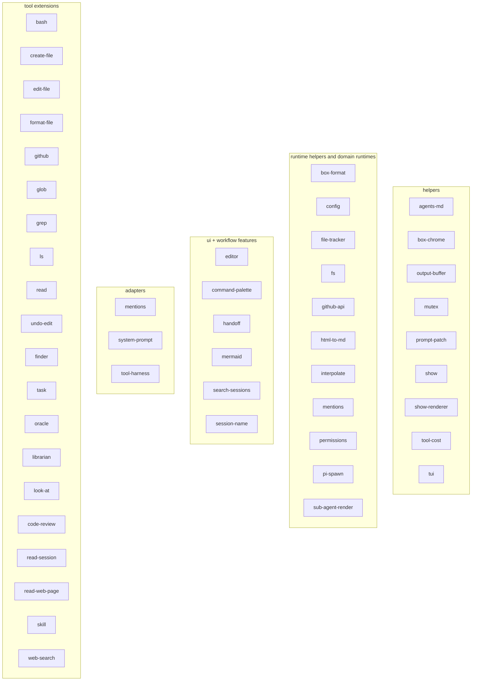
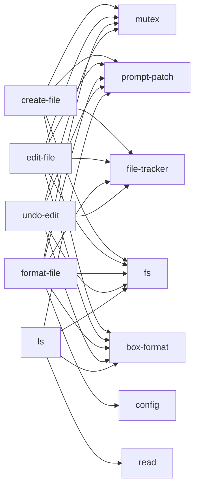
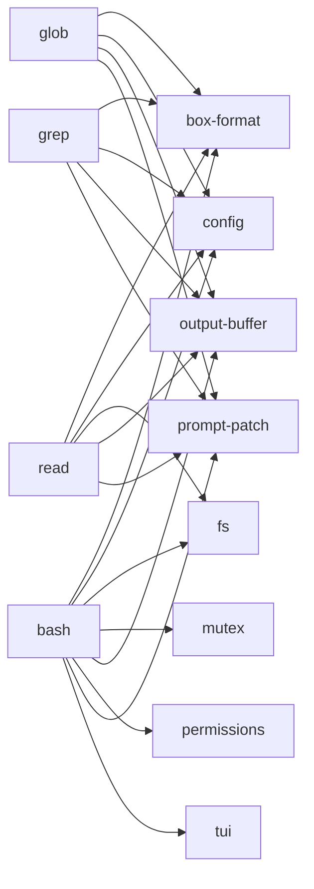
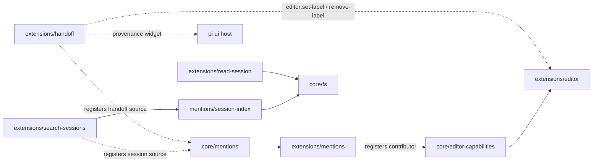
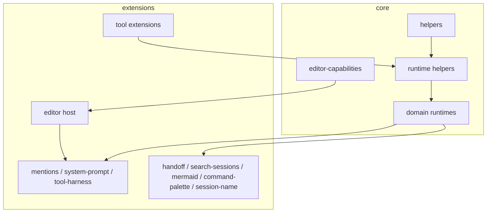

# package graph

this doc shows the repo-wide dependency and composition graph for `user/pi`.

it is based on:

- package manifests (`PACKAGE-MANIFEST-GRAPH.json`)
- code-read inventory across all core and extension packages

## how to read this

there are two kinds of edges here:

- **manifest dependency edges** — from `package.json` local `@bds_pi/*` deps
- **composition edges** — runtime relationships observed in code, even when there is no manifest dep edge strong enough to explain ownership clearly

---

## full package sets

### core packages

- agents-md
- box-chrome
- box-format
- config
- file-tracker
- fs
- github-api
- html-to-md
- interpolate
- mentions
- mutex
- output-buffer
- permissions
- pi-spawn
- prompt-patch
- show
- show-renderer
- sub-agent-render
- tool-cost
- tui

### extension packages

- bash
- code-review
- command-palette
- create-file
- e2e
- edit-file
- editor
- finder
- format-file
- github
- glob
- grep
- handoff
- librarian
- look-at
- ls
- mentions
- mermaid
- oracle
- read
- read-session
- read-web-page
- search-sessions
- session-name
- skill
- system-prompt
- task
- tool-harness
- undo-edit
- web-search

---

## role map



---

## core manifest dependency graph

this is the actual local `@bds_pi/*` dependency graph inside `packages/core/*`.

```mermaid
flowchart LR
  boxformat[box-format] --> boxchrome[box-chrome]
  boxformat --> show[show]

  mentions[mentions] --> fs[fs]

  interpolate --> config
  pispawn[pi-spawn] --> interpolate

  showrenderer[show-renderer] --> show

  subagentrender[sub-agent-render] --> pispawn
  subagentrender --> toolcost[tool-cost]
```

### notes

- most core packages are leaves
- `pi-spawn` and `sub-agent-render` are the deepest shared runtime spine
- `mentions` is no longer self-contained at the manifest level; session indexing now depends on `core/fs` for directory walking

---

## extension manifest dependency graph by cluster

## file tool cluster



## shell/search cluster



## sub-agent tool cluster

```mermaid
flowchart TB
  review[code-review] --> bash
  review --> glob
  review --> grep
  review --> ls
  review --> pispawn[pi-spawn]
  review --> patch[prompt-patch]
  review --> read
  review --> rweb[read-web-page]
  review --> sar[sub-agent-render]
  review --> wsearch[web-search]

  finder --> glob
  finder --> grep
  finder --> ls
  finder --> pispawn
  finder --> patch
  finder --> read
  finder --> sar

  oracle --> bash
  oracle --> glob
  oracle --> grep
  oracle --> ls
  oracle --> pispawn
  oracle --> patch
  oracle --> read
  oracle --> sar

  look[look-at] --> ls
  look --> pispawn
  look --> patch
  look --> read
  look --> sar

  librarian --> github
  librarian --> pispawn
  librarian --> patch
  librarian --> sar

  task --> bash
  task --> create[create-file]
  task --> edit[edit-file]
  task --> finder
  task --> format[format-file]
  task --> glob
  task --> grep
  task --> ls
  task --> pispawn
  task --> patch
  task --> read
  task --> skill
  task --> sar

  rsession[read-session] --> config
  rsession --> fs
  rsession --> outbuf[output-buffer]
  rsession --> pispawn
  rsession --> patch
  rsession --> sar

  rweb --> boxformat[box-format]
  rweb --> config
  rweb --> html[html-to-md]
  rweb --> outbuf
  rweb --> pispawn
  rweb --> patch
  rweb --> sar
```



## feature/ui cluster

```mermaid
flowchart LR
  editor --> editorcaps[editor-capabilities]
  handoff --> config
  handoff --> pispawn[pi-spawn]
  librarian --> github
  mentionsx[mentions extension] --> mentionscore
  mentionsx --> editorcaps
  searchsessions[search-sessions] --> boxformat
  searchsessions --> config
  searchsessions --> fs
  searchsessions --> patch[prompt-patch]
  sessionname[session-name] --> config
  skill --> boxformat
  skill --> patch
  sysp[system-prompt] --> config
  sysp --> interpolate
  sysp --> pispawn
  wsearch[web-search] --> boxformat
  wsearch --> config
  wsearch --> patch
  wsearch --> toolcost[tool-cost]
```

---

## composition graph beyond manifests

manifest deps alone miss some important relationships.

## editor/mentions/handoff/session flow



### why this matters

- `editor` is not just another feature extension; it is the repo’s main ui host
- `mentions` no longer hard-wires editor behavior directly; it crosses into ui autocomplete through `core/editor-capabilities`, which is the cleaner boundary
- `handoff` now owns the `handoff` mention source while still composing with `editor` softly through `pi.events`
- `search-sessions` now owns the `session` mention source while sharing session parsing with `core/mentions`
- hotspot 2 pulls path + traversal seams out of `extensions/read`, so session discovery and file-aware tools no longer depend on read as an accidental helper hub

---

## dependency hubs

these are the biggest hubs by actual local dependency footprint.

### core hubs

| package            | why it is a hub                                     |
| ------------------ | --------------------------------------------------- |
| `config`           | pulled into most extensions for namespaced settings |
| `box-format`       | shared result rendering for most tools              |
| `pi-spawn`         | main sub-agent runtime spine                        |
| `sub-agent-render` | shared rendering/result shaping for sub-agent tools |
| `mentions`         | central to current addressable-history feature set  |
| `prompt-patch`     | lightweight but almost everywhere in tools          |

### extension hubs

| package  | why it is a hub                                                                      |
| -------- | ------------------------------------------------------------------------------------ |
| `read`   | still a tool hub for file-aware sub-agent tool suites                                |
| `fs`     | now owns shared path and directory traversal semantics that had leaked out of `read` |
| `bash`   | shared by `oracle`, `task`, `code-review`                                            |
| `github` | shared by `librarian`                                                                |
| `finder` | shared by `task`                                                                     |
| `editor` | runtime ui host, even though manifest deps do not show it as a dependency target     |

---

## current important composition edges

## 1. `mentions extension -> core/editor-capabilities -> editor`

this is the new host/contributor seam for editor autocomplete.

- current effect: editor stays generic while mentions contributes its adapter-specific autocomplete wrapper
- future direction: let other editor affordances compose through the same typed seam without importing feature semantics into the host

## 2. `mentions extension -> core/mentions`

this one is healthy.

- current effect: lifecycle adapter over a shared domain runtime
- current boundary: namespace ownership now sits with registered sources instead of a hardcoded central switch

## 3. `search-sessions -> mentions/session-index`

this is also healthy.

- current effect: shared session parsing instead of duplicated session tool logic
- future direction: keep shared session runtime, but let session-domain ownership live with the session feature package

## 4. `handoff -.events.-> editor`

this is the cleanest current example of loose extension composition.

- current effect: optional editor labels/status when editor host exists
- future direction: preserve this pattern for soft ui affordances

---

## target graph direction

the target is not to flatten everything. it is to clean up the boundary between hosts, adapters, features, and domain runtimes.



### concrete intended shifts

- `core/mentions` is now the source/registry/runtime layer for addressable references
- `core/fs` is the shared path + traversal seam for file-aware helpers that used to leak out of `extensions/read`
- `extensions/mentions` stays the pi lifecycle adapter
- `extensions/editor` is the host for optional autocomplete contributors
- `extensions/handoff` remains self-sufficient and now contributes `handoff` mention semantics
- `extensions/search-sessions` keeps session search and now owns `session` mention semantics for its domain

---

## machine-readable source of truth

for scripts and future checks, see:

- `PACKAGE-MANIFEST-GRAPH.json` — raw manifest-level local deps
- `ARCHITECTURE-INVENTORY.json` — curated package inventory with roles/purposes/registers/composition

---

## short version

this repo’s graph is not flat.

- `config`, `box-format`, `prompt-patch`, `pi-spawn`, and `sub-agent-render` are the big shared spines
- `editor` is the main ui host
- `mentions`, `handoff`, and `search-sessions` form the current addressable-history/workflow cluster
- many extensions are tool surfaces over shared runtime helpers

that is the graph future refactors need to respect.
