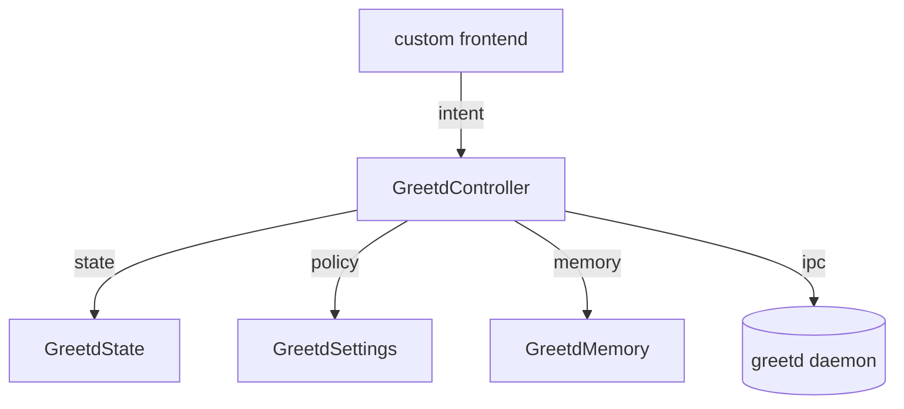

# greetd core

this folder is the first cut of a skin-agnostic greetd backend for quickshell.

goal: keep auth/session behavior stable while letting the login ui get weird.

## contract

frontend code should:
- instantiate `GreetdController` once
- read mutable model from `GreetdState`
- read capabilities + feedback from `GreetdController`
- call controller methods for username, password, session selection, and auth
- avoid talking to `Quickshell.Services.Greetd` directly while the controller is mounted

wrapper / system glue should:
- create `QS_GREETD_CFG_DIR` for the greeter user
- provide `settings.json` when non-default behavior is needed
- point quickshell at a dedicated root file such as `/etc/quickshell-greeter/greetd-shell.qml`
- let greetd own authentication; this module is only a frontend-side protocol driver

non-goals here:
- wallpaper, clock, power menu, profile avatars
- focus choreography beyond a minimal happy path
- shell-specific services like weather, battery, audio, bluetooth

